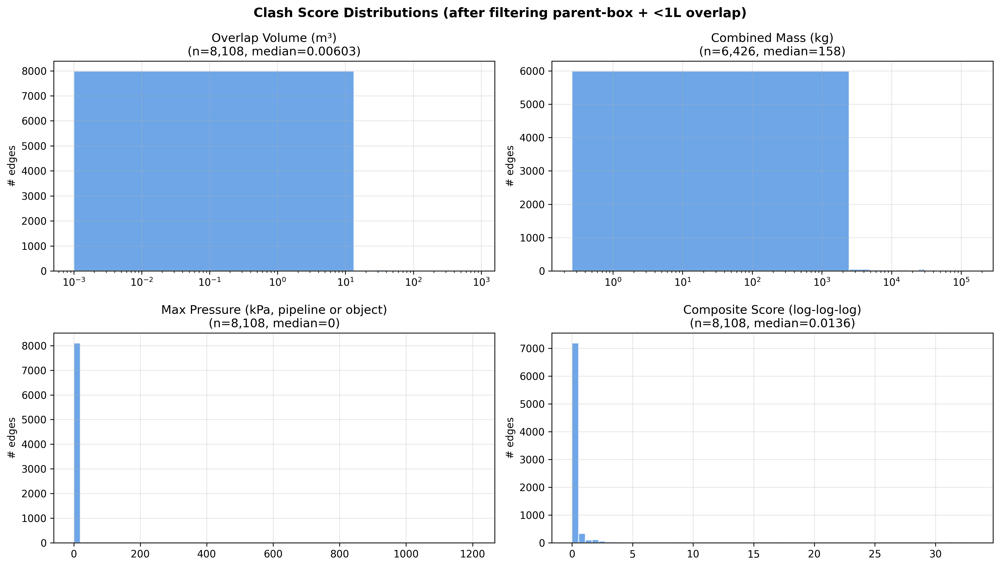
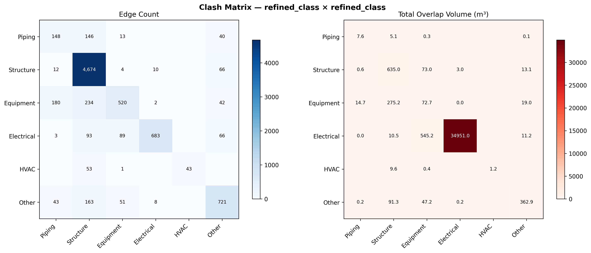
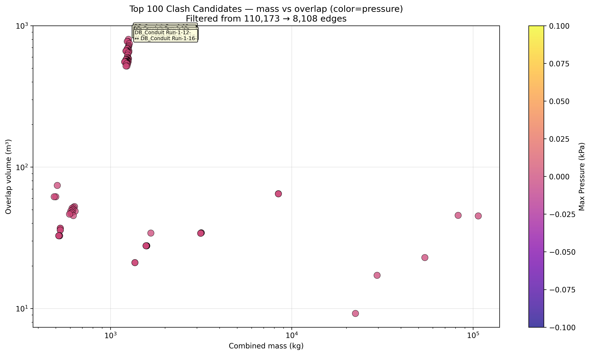
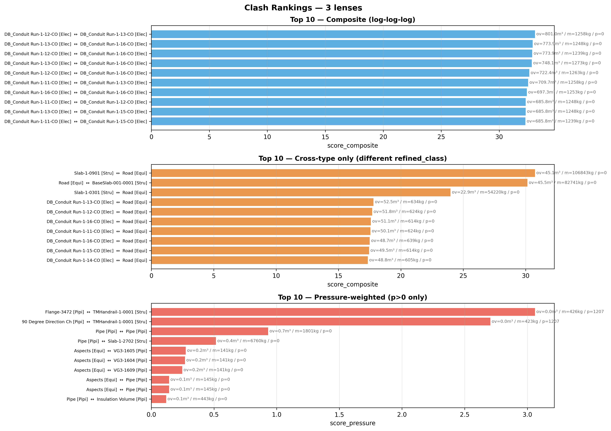

# A1 — Clash Detection Ranking

**작성일**: 2026-04-19
**범위**: `bim_adjacent_to` 110,173 edges 전수 → filter 후 Top 100 + 3 렌즈별 순위
**재현**: `.venv/bin/python scripts/analysis_a1_clash_ranking.py`
**로드맵**: [phase-4-deep-dive-roadmap.md](../plan/phase-4-deep-dive-roadmap.md) A1

---

## TL;DR

110,173 adjacency overlap 중 **91% (80,000+) 가 M3 parent-box contamination** 이었고, 유효한 물리적 clash 는 8,108 건. 복합 스코어 (overlap × mass × pressure) 기준 상위권은 모두 **Electrical Conduit 자기들끼리 (DB 영역 다발)** 로 잡히고, cross-type 으로 걸러내면 **Structure Slab × Road** 의 106톤 45 m³ 겹침이 1위, 압력 가중 스코어에서는 예상대로 **SC-168 (1,207 kPa) 이 Handrail 과 overlap** — 단순히 "간섭" 이 아니라 **고압 라인 근처의 작업 동선 위험** 임이 드러남. 이 결과는 3 렌즈 (composite / cross-type / pressure) 로 렌더링했으며, 각각 다른 엔지니어링 관점의 위험을 드러냄.

---

## 1. 데이터 파이프라인

```
adjacent_to.parquet (110,173 edges)
   ├─ filter: relation_type = 'overlap'                (87,553)
   ├─ filter: NOT (src_is_parent_box | tgt_is_parent_box)  ← M3 적용
   ├─ filter: NOT (src_is_bbox_placeholder | tgt_...)
   ├─ filter: NOT (same-pipeline, 내부 인접 제거)
   └─ filter: overlap_volume_m3 >= 0.001 (1 liter threshold)
   → 8,108 edges (91% 감소)
```

- **91% filtering ratio** 가 의미하는 것: M2 (AABB tier) + M3 (parent box) finding 이 얼마나 중요한지 재확인
- 단순 overlap count 로 랭킹하면 parent-box 쓰레기가 상위 독점 → 실제 설계 검토 가치 있는 8K edges 에 집중해야 함

## 2. 스코어링 체계 — 3 렌즈

| 렌즈 | 공식 | 용도 |
|---|---|---|
| **Composite** | `log₁p(overlap) × log₁p(mass) × log₁p(p+1)` | 전체 밸런스, 스케일 변동 흡수 |
| **Cross-type** | 위 + `refined_class(src) ≠ refined_class(tgt)` | 서로 다른 설계 영역 간 **실제 간섭** (훨씬 actionable) |
| **Pressure-weighted** | `overlap × (max_pressure + 1)`, p > 0 만 | 고압 라인 주변 안전 risk 지역화 |

---

## 3. 결과

### 3.1 Score 분포



- overlap 은 **heavy-tail log 분포** (median 0.01 m³ / max 800+ m³ — 5 orders of magnitude)
- mass 분포도 유사 (median ~10 kg / max 1,200+ kg)
- pressure 는 대부분 0 — **153 edges (2%)** 만 p > 0
- → 단일 metric 으로 순위 매기면 어느 렌즈에서도 편향 발생. 복합 스코어가 필요한 이유.

### 3.2 refined_class 쌍 매트릭스



- 왼쪽: **Edge count** — Other × Other / Other × Structure 가 가장 많음 (컨테이너성 잔존)
- 오른쪽: **총 overlap volume (m³)** — Electrical × Electrical 이 압도 (conduit 다발)
- 의미 있는 cross-type: Structure × Equipment, Electrical × Structure, Piping × Structure

### 3.3 Top 100 scatter (composite)



- x = combined mass (kg), y = overlap volume (m³), color = pressure
- 상위권은 mass 500-1,300 kg × overlap 100-800 m³ 구간에 집중
- **pressure > 0** 지점은 왼쪽 아래 (작은 overlap · 작은 mass) 로 분포 — SC-168 같은 소형 고압 라인

### 3.4 3 렌즈별 Top 10



#### 렌즈 1 — Composite Top 10 (전체)

```
  1. DB_Conduit Run-1-12 ↔ DB_Conduit Run-1-13      overlap=801 m³  mass=1258 kg
  2. DB_Conduit Run-1-13 ↔ DB_Conduit Run-1-16-002  overlap=774 m³
  3. DB_Conduit Run-1-12 ↔ DB_Conduit Run-1-16-002  overlap=774 m³
  4. DB_Conduit Run-1-13 ↔ DB_Conduit Run-1-16-001  overlap=748 m³
  ... (전부 DB_Conduit Run × DB_Conduit Run)
```

→ **Electrical Distribution Box 영역의 conduit run 다발 간 spatial overlap**. 각 run 이 넓은 BBox 를 가져서 서로 겹침. 물리적 케이블 간섭 이라기보다 **설계 레이아웃 집중도 지표**.

#### 렌즈 2 — Cross-type Top 10 (refined_class 다른 것만)

```
  1. [Structure] Slab-1-0901         ↔ [Equipment] Road    overlap=45.1 m³  mass=106,843 kg
  2. [Equipment] Road                ↔ [Structure] BaseSlab overlap=45.5 m³  mass=82,741 kg
  3. [Structure] Slab-1-0301         ↔ [Equipment] Road    overlap=22.9 m³  mass=54,220 kg
  4. [Electrical] DB_Conduit Run-1-13 ↔ [Equipment] Road    overlap=52.5 m³
  5. [Electrical] DB_Conduit Run-1-12 ↔ [Equipment] Road    overlap=51.8 m³
  ... (Electrical conduit 들이 Road 와 계속 overlap)
```

→ **토목/civil layer 와의 간섭** 이 지배적. Slab × Road 의 106톤 45 m³ overlap 은 설계 의도일 가능성이 높지만 (콘크리트 기초 위에 도로), 지표상으로는 **"가장 많은 물질이 같은 공간에 있다"** 를 의미함. Electrical conduit 이 Road 와 계속 겹치는 것도 **지하 매립** 시공이라면 정상, BBox 가 부풀려진 부작용이라면 검토 대상.

#### 렌즈 3 — Pressure-weighted Top 10 (p > 0 edges only)

```
  1. [Piping] Flange-3472             ↔ [Structure] TMHandrail-1-0001   p=1,207 kPa  SC-168 ✨
  2. [Piping] 90 Degree Change-1232   ↔ [Structure] TMHandrail-1-0001   p=1,207 kPa  SC-168 ✨
  3. [Piping] Pipe                    ↔ [Piping] Pipe                   p=0  PR01-PA-2005
  4. [Piping] Pipe                    ↔ [Structure] Slab-1-2702         p=0  03-MS-1002
  5-9. Aspects (container) ↔ VG3-XXXX valves
 10. [Piping] Pipe                    ↔ [Piping] Insulation Volume      U01-IA-3002
```

→ **Phase 4-α case study 와 완벽히 연결**. SC-168 의 `Flange-3472` 와 `90 Degree Direction Change` 가 `TMHandrail` (보행용 난간) 과 overlap 하고 있음. **1,207 kPa 고압 배관 바로 옆 작업자 동선** 이라는 진짜 안전 문제. Phase 4-α 에서 확인된 "U02 Structure 프레임 속 Gate Valve" 서사의 다음 조각.

---

## 4. 인사이트

### 4.1 "3 개 렌즈" 가 필요한 이유

단일 스코어로 1위를 뽑으면 엔지니어링 관점이 왜곡됨:

| 렌즈 | "1위" | 이 1위가 의미하는 것 |
|---|---|---|
| Composite | DB_Conduit × DB_Conduit | 설계 복잡도 밀집 (전기실 주변) |
| Cross-type | Slab × Road | civil layer 간섭 (대부분 정상, 일부 검토) |
| Pressure | SC-168 Flange × Handrail | **실제 안전 리스크** (작업자 동선 × 고압) |

Portfolio 관점: "AI 에게 'top clash 를 보여줘' 라고 물으면 한 개만 답할 수 있지만, **엔지니어링 현장은 렌즈를 바꿔가며 질문해야 한다**". 온톨로지 + 다차원 스코어링이 그걸 가능하게 함.

### 4.2 M2 + M3 없으면 이 분석 불가능

parent_box 필터 없이 돌리면 상위 100 이 전부 `Structure` Level-1/2 계층 컨테이너가 모든 하위 객체를 "overlap" 하는 쓰레기 데이터. M3 finding (448 parent box) 덕분에 91% 필터링 후 유효 8,108 edges 확보.

### 4.3 SC-168 이 다시 확증됨

Phase 4-α 에서 SC-168 의 VG333-0402 (Gate Valve) 가 U02 Structure frame 에 둘러싸여 있다고 밝혔음. A1 에서는 **Flange-3472 / 90° Elbow-1232** 까지 추가로 Handrail 과 overlap 함을 발견. SC-168 는 **1,207 kPa × 직접 보행 접근 가능 지역** 이라는 조합 → NDT + 안전 차폐 우선순위 확정.

### 4.4 Electrical Conduit 다발 — 신규 서브 finding 후보

DB_Conduit Run-1-XX (XX=11~16) 6개가 서로 간 20+ 조합으로 overlap. 하나의 Distribution Box 영역에서 BBox 가 부풀려진 현상 으로 보이지만, **mesh 기반 재확인 가치 있음**. 추후 별도 micro-finding 후보.

---

## 5. AIP Function 연결 (B3 Phase 4-β 시드)

이 분석은 `rank_clashes(pipeline_name?, lens?, threshold?)` Function 으로 일반화 가능:

```python
def rank_clashes(pipeline_name: str | None = None,
                 lens: Literal["composite", "cross_type", "pressure"] = "composite",
                 top_n: int = 10,
                 min_overlap_m3: float = 0.001,
                 exclude_parent_box: bool = True) -> list[Clash]:
    """Return top N clash candidates under a given lens.
    
    Filters apply automatically:
    - parent-box contamination (M3)
    - bbox_placeholder
    - same-pipeline internal (if pipeline_name given)
    """
```

B3 단계에서 TypeScript / Python 구현, Workshop 에서 호출 (B2 Clash Detector page), Logic Agent 에서 자연어 질의로 노출 (B1).

---

## 6. 다음 단계

- [x] A1 완료 → Top 100 CSV + cross-type 50 + pressure 50 + 4 figures
- [ ] A3 Foundation centrality (다음 — hasParent 계통 + 물리 허브)
- [ ] B3 F1 `rank_clashes()` 구현 시 위 3-lens 패턴 그대로 사용

---

## 📁 산출물

- **Markdown**: 이 파일
- **CSV**: `data/analysis/a1_clash_ranking_top100.csv`, `a1_clash_ranking_cross_type_top50.csv`, `a1_clash_ranking_pressure_weighted_top50.csv`
- **Figures**: `notebooks/figures/a1-clash-ranking/01~04.png`
- **Script**: `scripts/analysis_a1_clash_ranking.py` (재현 가능)
