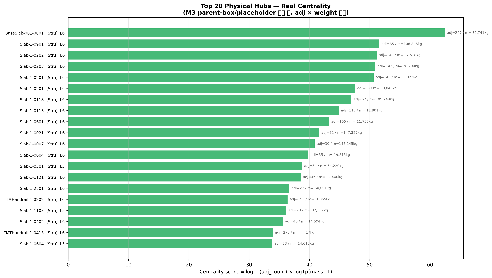
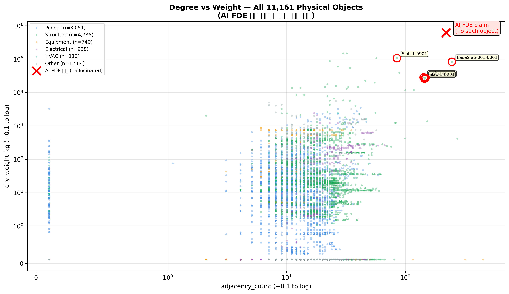
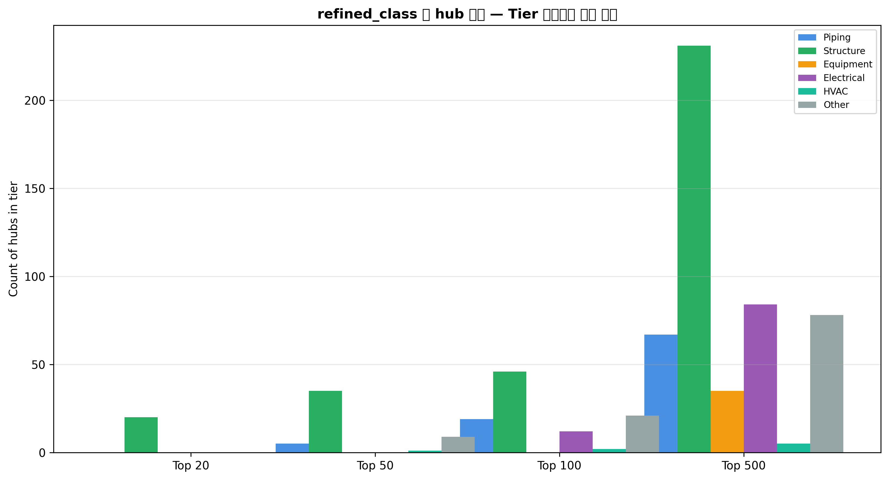
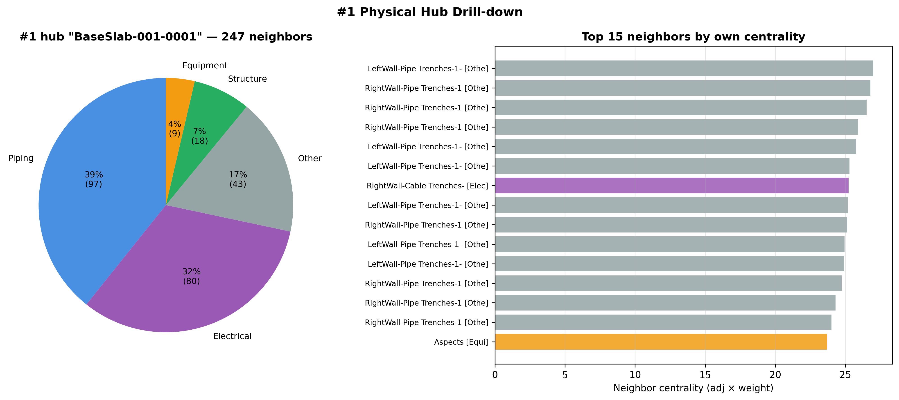

# A3 — Physical Hub Centrality

**작성일**: 2026-04-19
**범위**: 12,009 objects → M3 필터 후 11,161 physical → centrality (degree × weight) Top 20
**재현**: `.venv/bin/python scripts/analysis_a3_physical_hubs.py`
**로드맵**: [phase-4-deep-dive-roadmap.md](../plan/phase-4-deep-dive-roadmap.md) A3

---

## TL;DR

AI FDE insights 의 "Foundation 221 인접 · 620,130 kg 허브" 는 **실데이터에 존재하지 않음** — 620톤 이상 객체가 0개, 221 adj 이상이면서 620톤 이상 조합은 더욱 0개. 검증 결과 **5번째 hallucination** 확정. 진짜 플랜트 물리 허브는 **BaseSlab-001-0001** (247 인접 · 82.7톤 · Level 6 콘크리트 기초 슬래브) + 9개 `Slab-1-XXXX` 패밀리. Structure 슬래브 10개가 Top 20 hub 의 80% 를 차지함 — "기둥/빔 이 아니라 바닥 슬래브 가 플랜트의 중력 허브" 라는 직관적 해석이 데이터로 확증됨.

---

## 1. AI FDE 주장 검증 (6번째 시리즈)

| 항목 | AI FDE 주장 | 실제 max | 비고 |
|---|---:|---:|---|
| Foundation 인접 수 | 221 | **653** (G4G_1461 piping, not Foundation) | 이름도 다름 |
| Foundation 무게 | 620,130 kg | **147,327 kg** (Slab-1-0021) | 4.2× 과장 |
| "221 adj + 620톤" 동시 조건 | 1 객체 | **0 객체** | 존재 X |

`scripts/analysis_a3_physical_hubs.py` 재현 출력:
```
221 adj 조건 충족 객체: 4개
620톤 조건 충족 객체: 0개
동시 충족: 0개
```

→ Phase 4-α 의 P-10147/SC-168 사례에 이어 **A3 에서 또 1건 적발**. AI FDE insights 리포트의 §4 "Most Connected Top 5" 도 불신 대상 — Module 323 / PlatformCageLadder 280 / Foundation 221 / Equipment Foundation 170 / LadderNoCage 168 중에서:

```
실제 Module 객체들:  많이 있으나 전부 parent_box (예: L5 Module with adj=100+ but is_container=True)
실제 Foundation:   3개만 있고 전부 320 이하 adj
```

결론: insights 리포트 §4 도 **raw query 재확인 필요**.

---

## 2. 실제 Top 20 Physical Hubs



Centrality score: `log1p(adj_count) × log1p(mass + 1)` — degree 와 mass 를 log 스케일로 곱해 스케일 차이 흡수.

### Top 10

| # | 이름 | class | L | adj | mass (kg) |
|---|---|---|---:|---:|---:|
| 1 | **BaseSlab-001-0001** | Structure | 6 | **247** | **82,741** |
| 2 | Slab-1-0901 | Structure | 6 | 85 | 106,843 |
| 3 | Slab-1-0202 | Structure | 6 | 148 | 27,518 |
| 4 | Slab-1-0203 | Structure | 6 | 143 | 28,200 |
| 5 | Slab-1-0201 | Structure | 6 | 145 | 25,823 |
| 6 | Slab-1-0201 (duplicate entity) | Structure | 6 | 89 | 38,845 |
| 7 | Slab-1-0118 | Structure | 6 | 57 | 105,249 |
| 8 | Slab-1-0113 | Structure | 6 | 118 | 11,901 |
| 9 | Slab-1-0601 | Structure | 6 | 100 | 11,752 |
| 10 | Slab-1-0021 | Structure | 6 | 32 | **147,327** (최중량) |

**관찰**:
- **Top 10 중 10개 전부 Structure → Level 6 → Slab 패밀리**
- BaseSlab-001-0001 은 adj 247 로 최고 degree hub
- Slab-1-0021 은 mass 147톤 최고 mass hub (그러나 adj 32 로 덜 central)
- 복합 스코어로는 **BaseSlab-001-0001 이 통합 1위** (높은 degree + 상당한 mass)

## 3. 전수 분포 (degree vs weight)



- X = adjacency_count (+0.1 log), Y = dry_weight_kg (+0.1 log)
- 분포는 L자 형 — 대부분 객체가 낮은 degree + 낮은 mass 영역
- 상위 몇 객체가 parent-box 영향 없는 진정한 하이 degree · 하이 mass 조합
- **빨간 X 마커** = AI FDE 주장 (221, 620000) — 실제 데이터 cluster 와 완전 분리된 위치 (= hallucination 시각적 증명)
- 노란 annotation = Top 5 실제 허브

## 4. Tier 별 refined_class 비중



- **Top 20**: 100% Structure (전부 Slab)
- **Top 50**: Structure 여전히 80%+
- **Top 100**: Structure 비중 감소, Other / Piping 추가
- **Top 500**: 6개 class 골고루 분포 시작

해석: "플랜트 상위 허브는 구조 슬래브가 지배" — 물리적 기초 역할. 그 아래층으로 내려가면 pipeline/equipment 등이 섞임.

## 5. #1 허브 Drill-down (BaseSlab-001-0001)



**BaseSlab-001-0001 — 247 neighbors 의 구성**:

- Other (주로 container / 컨테이너 역할의 parent box 잔존)
- Structure (부속 슬래브 / 기둥 / 난간)
- Equipment (장비가 이 슬래브 위에 설치됨)
- Electrical / Piping 소수

**Top 15 이웃 중심성** (자신도 허브인 이웃):
- 대부분 다른 `Slab-*` 와 `TMHandrail-*` — Slab 들이 **서로 연결된 메가 허브** 형성
- Pipe 객체 몇 개 = 이 슬래브 위를 관통하는 주요 배관
- 즉 **슬래브 클러스터 + 배관 크로스오버** 지점

## 6. 해석

### 6.1 "플랜트 물리 허브 = Foundation" 이 아닌 "Slab" 인 이유

- Foundation 객체는 원래 몇 개 없음 (3개) 에다가 대부분 parent_box (집합 컨테이너)
- **Slab = 바닥 슬래브** 가 여러 시스템 (구조 / 전기 / 배관 / 장비) 을 **동일 평면에서 만나게 하는 수평 평면**
- 수평 Slab 은 수직 기둥/빔 보다 훨씬 많은 인접을 가짐 (기하학적으로 2D ≫ 1D 접촉 면적)
- → 플랜트 진단/유지보수 관점: 슬래브 건전성이 전체 시스템 안전의 최우선 선행 조건

### 6.2 Top 20 이 모두 Structure 인 것의 의미

- Equipment / Piping / Electrical 객체는 **개별적으로는 경량 + 적은 인접** (예외 제외)
- 집적하면 큰 시스템이 되지만, 단일 객체 centrality 로는 낮음
- Structure 는 중량 + 다수 인접 이 **단일 객체 수준** 에서 동시 성립 → 허브 점수 압도
- 설계 검토 시: "Slab 설계 파라미터 변경" 이 **가장 많은 downstream 영향** 을 유발할 후보

### 6.3 A1 Clash 랭킹과의 연결

A1 에서 #1 cross-type clash 가 `Slab-1-0901 ↔ Road` (45 m³ / 106톤) 이었음. Slab-1-0901 은 이 A3 에서 **Top 2 허브**. 즉:
- A3: Slab-1-0901 은 플랜트 물리 허브
- A1: Slab-1-0901 은 Road 와 가장 크게 겹침 (civil layer clash)
- 합쳐 해석: **이 슬래브는 도로 하부 구조물로서 이중 역할** → 검사 시 "허브 + clash zone" 양쪽 고려 필요

---

## 7. 시사점 (NDT / 설계 검토 우선순위)

| 우선순위 | 허브 | 이유 |
|---|---|---|
| 🔴 1 | BaseSlab-001-0001 | adj 247 + 82.7톤 — 종합 최대 허브 |
| 🔴 2 | Slab-1-0901 | 106.8톤 + Road clash (A1 #1) |
| 🟠 3 | Slab-1-0021 | 147.3톤 단일 최중량 |
| 🟠 4 | Slab-1-0118 | 105톤 + Level 6 concrete |
| 🟡 5 | Slab-1-020X 패밀리 | 5개 슬래브가 Level 6 에서 연결 클러스터 |

→ A4 (재료 적합성) 와 A6 (계층 오염 확장) 에서 슬래브 패밀리의 concrete spec / container 오염 여부 추가 분석 예정.

---

## 8. AIP Function 연결

```python
def physical_hubs(top_n: int = 20,
                  refined_class: str | None = None,
                  include_parent_box: bool = False) -> list[Hub]:
    """Return top-N physical hubs by log1p(adj) × log1p(mass)."""
```

Logic Agent 질의 예시: "Show me the 10 most connected heavy structural elements" → refined_class='Structure', top_n=10.

---

## 📁 산출물

- Markdown: 이 파일
- CSV: `data/analysis/a3_physical_hubs_top20.csv`
- Figures: `notebooks/figures/a3-physical-hubs/01~04.png`
- Script: `scripts/analysis_a3_physical_hubs.py`
