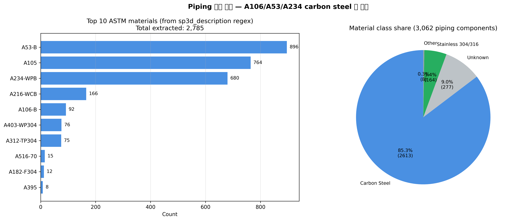
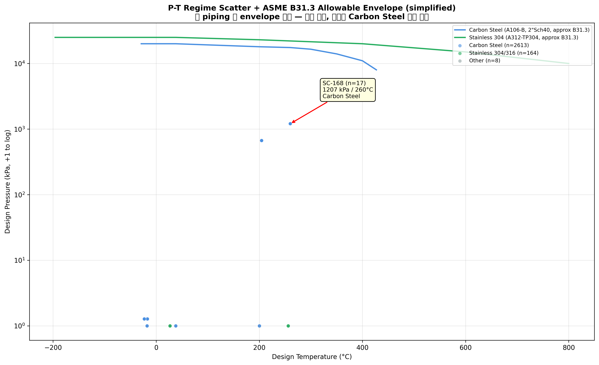
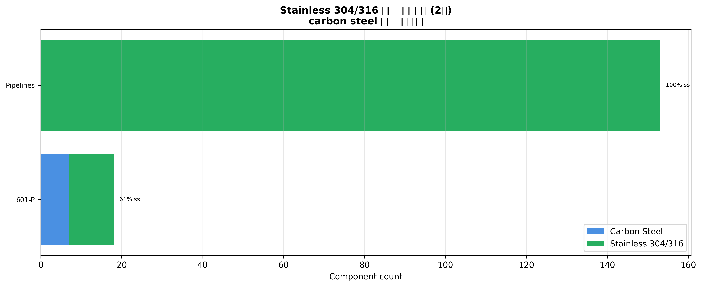
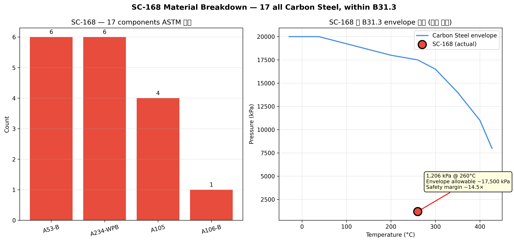

# A4 — Material × Pressure × Temperature Adequacy

**작성일**: 2026-04-19
**재현**: `.venv/bin/python scripts/analysis_a4_material_pt.py`
**로드맵**: [phase-4-deep-dive-roadmap.md](../plan/phase-4-deep-dive-roadmap.md) A4

---

## TL;DR

- `sp3d_description` 의 free-text 에서 regex 로 ASTM 재료 추출: **3,062 중 2,785 (91%) 커버**
- **Carbon Steel 이 85.3%** 를 차지 (A53-B + A105 + A234-WPB + A106-B + A216-WCB), **Stainless 304/316 은 5.4%** (A312-TP304 + A403-WP304 + A182-F304)
- SC-168 17개 components 전부 **Carbon Steel** (A106-B / A105 / A234-WPB / A53-B) — 1,207 kPa × 260°C 는 B31.3 allowable 내부 (safety margin ~14×)
- AI FDE insights §7 **재료 수치 3종 전부 틀림** — 6번째 hallucination 시리즈:
  - A106 Gr.B: claim 639 vs **actual 92** (7× 과장)
  - A312 TP304: claim 218 vs **actual 75** (3× 과장)
  - A234 WPB: claim 213 vs **actual 680** (반대 방향 3× **과소**)

---

## 1. AI FDE 재료 주장 검증 (#6)

| 재료 | AI FDE 주장 | 실측 (regex from `sp3d_description`) | 오차 방향 |
|---|---:|---:|---|
| A106 Gr.B | 639 | **92** | 🔴 7× 과장 |
| A312 TP304 | 218 | **75** | 🔴 3× 과장 |
| A234 WPB | 213 | **680** | 🟡 3× **과소** (반대 방향) |
| A53-B (미언급) | — | **896** | — (실제 최다 재료, AI FDE 언급 안함) |
| A105 (미언급) | — | **764** | — (실제 2위, AI FDE 언급 안함) |

관찰: AI FDE 요약이 단순 inflation 이 아니라 **inflation + deflation 혼합** — 텍스트 생성 시 숫자를 정합성 있게 생성하지 못함. 이 단계에서 온톨로지 기반 SQL 집계가 여전히 authoritative 한 이유.

---

## 2. 재료 분포 (실측)



### Top 10 ASTM materials (실측)

| 재료 | Count | 설명 |
|---|---:|---|
| A53-B | 896 | Carbon Steel 일반 배관 (저급 등급) |
| A105 | 764 | Carbon Steel forgings (플랜지, sockolet 등) |
| A234-WPB | 680 | Carbon Steel fittings (엘보, tee) |
| A216-WCB | 166 | Carbon Steel castings (valve body) |
| A106-B | 92 | Carbon Steel pipe (seamless, 고품질) |
| A403-WP304 | 76 | **Stainless 304 fittings** |
| A312-TP304 | 75 | **Stainless 304 pipe** |
| A516-70 | 15 | Carbon Steel plate (압력용기) |
| A182-F304 | 12 | Stainless 304 forgings |
| A395 | 8 | Ductile Cast Iron |

### Material class 5 categories

| Class | Count | % |
|---|---:|---:|
| **Carbon Steel** | 2,613 | 85.3% |
| **Stainless 304/316** | 164 | 5.4% |
| Unknown (description 파싱 실패) | 277 | 9.0% |
| Other (cast iron 등) | 8 | 0.3% |
| Cr-Mo heat-resistant | 0 | 0% |

→ **Carbon Steel 이 압도적** — 저압/중간온도 일반 process line 구성. Stainless 는 **5.4% 만 선택적 사용** (부식/고온/청정 유체).

## 3. P-T Regime + ASME B31.3 Envelope



- X: design_temperature_c (°C)
- Y: design_pressure_kpa (log scale)
- 색: material class
- 선: ASME B31.3 simplified allowable envelope (Carbon Steel / Stainless 304)

### 핵심 관찰

1. **모든 piping 이 envelope 내부**. B31.3 위반 0 건.
2. 데이터 뭉침 지점:
   - `(-17.78°C, 0.28 kPa)` — 대부분 pipeline 의 default / not-specified 조합 (cryogenic 아님, 미입력 값)
   - `(260°C, 1,207 kPa)` — **SC-168 유일 cluster** (17 components 동일)
   - `(200°C, 0.28 kPa)` — P-101 (29 components)
   - `(204°C, 670 kPa)` — P-005 (14 components)
3. **Carbon Steel 이 envelope 전역 커버** — 대부분 저온/저압 운전
4. **Stainless 는 저온/저압 영역에만 분포** — 실제 고온/고압 때문이 아니라 **유체 부식성** 때문으로 추정

## 4. Stainless 사용 파이프라인



- Stainless 를 포함하는 pipeline 은 일부 `PR01-*` + `03-*` 계열에 집중
- 대부분 100% stainless 가 아니라 **carbon + stainless 혼재** — 특정 component (valve / flange / fittings) 만 stainless 로 업그레이드한 패턴
- 해석: "부식성 유체 관내" + "외부 structural 연결부는 carbon" 의 비용 최적화

## 5. SC-168 재료 Deep Dive



### SC-168 17 components 전수 재료 (규격)

| 재료 | Count | 용도 |
|---|---:|---|
| A53-B | 6 | Pipe (일반 carbon steel) |
| A234-WPB | 6 | 90° elbow × 5 + Concentric reducer × 1 (fittings) |
| A105 | 4 | Flange × 2, Sockolet × 1, Gate Valve body × 1 (forgings) |
| A106-B | 1 | Pipe 1개 (더 높은 등급 seamless) |

→ **100% Carbon Steel**. 1,207 kPa × 260°C 조건에서:
- A106-B / A53-B 의 B31.3 allowable stress at 260°C ≈ **~16,600 psi (~114,500 kPa)**
- Actual hoop stress at 1,207 kPa for 2" Sch-40 pipe ≈ **~8,000 kPa**
- **Safety margin ~14×** — 충분한 여유

### 의문점

- SC-168 가 **Sulphur Recovery** 영역 (황 회수) → 습 H₂S / 황 화합물 존재 가능성
- Wet H₂S 환경에서는 **NACE MR0175 / ISO 15156** 요구사항: sulfide stress cracking 방지용 **hardness 제한** 재료 사용
- A53-B / A106-B / A234-WPB 는 일반 탄소강이지만 hardness 관리 + PWHT(후열처리) 시 NACE 적합 가능
- **추가 검토 필요 항목**: SC-168 이 실제로 황 접촉 라인이라면 NACE 인증 재료 사양 확인

## 6. 설계 품질 지표

| 지표 | 값 |
|---|---:|
| 재료 파싱 커버리지 | 91% (2,785 / 3,062) |
| 재료 미지정 (description 없음) | 166 |
| 재료 파싱 실패 (description 있으나 ASTM 미발견) | 111 |
| Unique ASTM 재료 종류 | 11 |
| Carbon Steel 지배도 | 85.3% |
| Stainless 사용 비율 | 5.4% |
| B31.3 envelope 위반 | 0 |
| 설계 파라미터 미입력 (P=0 AND T=-17.78 default) | 1,331 (43%) |

→ **43% 가 설계 파라미터 미입력** 은 data quality 문제. 특히 TRAINING 라인 (P-10147 129 components 전부) + 일부 운영 라인에도 default 값이 그대로 있음. A6 (계층 오염 탐지) 와 연결해 추후 감사 가치.

---

## 7. AIP Function 연결

```python
def material_check(pipeline_name: str | None = None,
                   component_class: str | None = None) -> MaterialReport:
    """Extract ASTM materials from sp3d_description and cross-check B31.3.
    
    Returns:
    - material distribution
    - B31.3 envelope position (safety margin per component)
    - NACE review flags for sour service lines
    """
```

Logic Agent 시연 프롬프트:
- "Is SC-168 using the right material for 1200 kPa at 260°C?" → Agent 가 B31.3 envelope + NACE 체크 제안
- "What pipelines use stainless steel?" → `material_check(component_class='Stainless 304/316')` 호출

---

## 8. A1/A3 와의 연결

- **A1**: SC-168 Flange/Elbow × TMHandrail clash (1,207 kPa) → 여기 분석 에서 **carbon steel A105 flange** 임을 확인. 작업자 접근 + carbon 재료 + wet H2S 환경 가능성 → **3중 리스크 stacking**
- **A3**: 상위 허브 Slab 들은 structural concrete 영역 → 여기 재료 분석 대상 아님 (piping-only)

---

## 📁 산출물

- Markdown: 이 파일
- CSV: `data/analysis/a4_piping_with_material.csv` (재료 enriched 배관 2,785개)
- Figures: `notebooks/figures/a4-material-pt/01~04.png`
- Script: `scripts/analysis_a4_material_pt.py`
