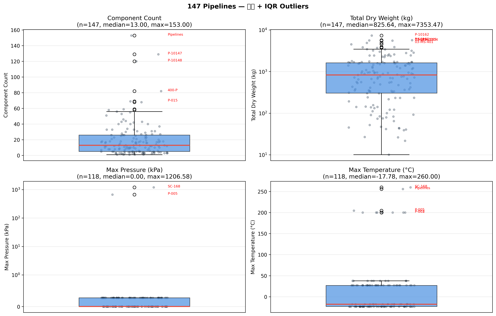
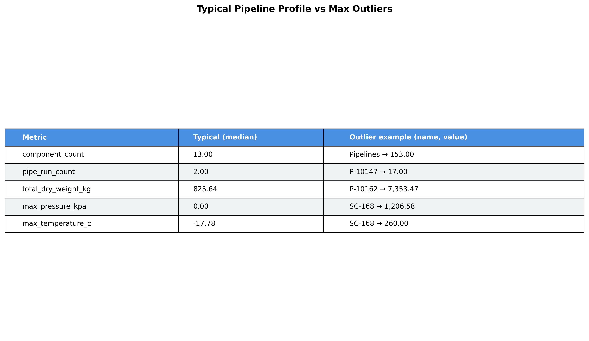
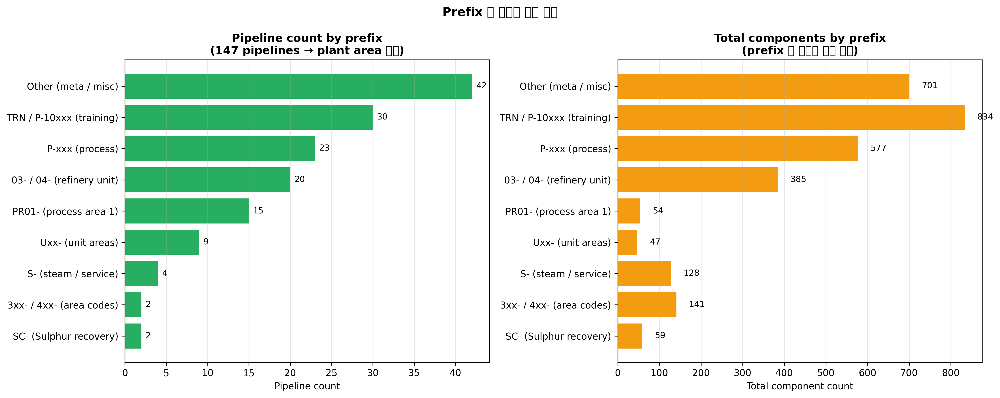
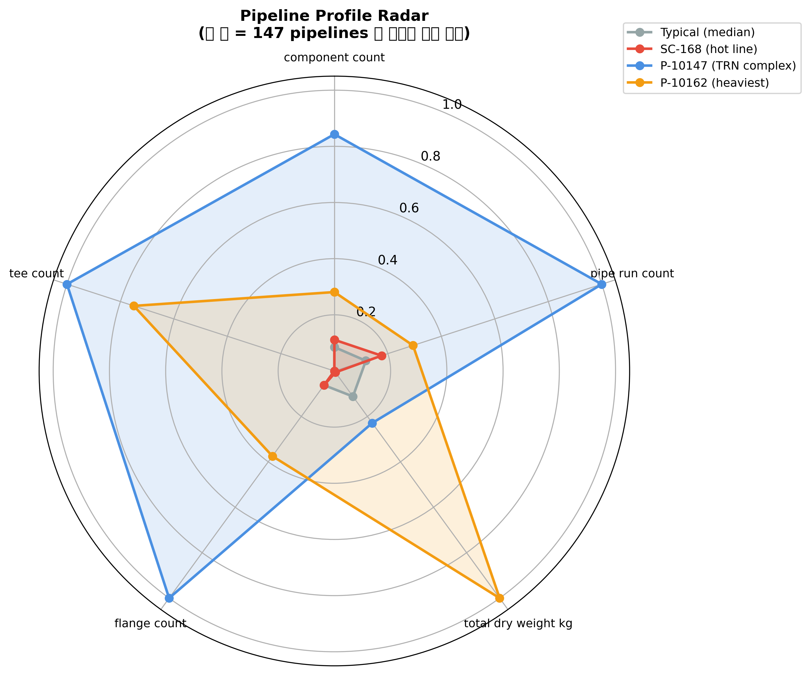

# A5 — Pipeline Balancing

**작성일**: 2026-04-19
**범위**: 147 pipelines aggregate 전수 — 분포 / IQR outlier / prefix 분류 / typical profile
**재현**: `.venv/bin/python scripts/analysis_a5_pipeline_balancing.py`
**로드맵**: [phase-4-deep-dive-roadmap.md](../plan/phase-4-deep-dive-roadmap.md) A5

---

## TL;DR

"평균적 pipeline" 은 **13 components / 2 runs / 826 kg / 압력 미지정** 의 소형 모듈. 147 중 **50개만 pressure > 0** (나머지 97개 미입력), **2개만 실질적 고압** (SC-168 + P-005). IQR outlier: 복잡도 8개 / 무게 9개 / 고압 2개. Prefix 분류로 보면 `03-/04-` refinery unit 18개 + `PR01-` process area 15개 + `TRN/P-10xxx` 30개 (training) + `SC-` Sulphur 2개 + `U0x-` unit 9개 등으로 **플랜트 기능별 구조** 가 읽힘. 이상 징후 1건: pipeline_name = `"Pipelines"` 라는 **메타-이름 라인 153 components** — SP3D 에서 명명 누락된 보조 그룹으로 추정.

---

## 1. Typical Pipeline Profile (median)

| 지표 | Median | p25 | p75 | Max |
|---|---:|---:|---:|---:|
| component_count | **13** | 5 | 26 | 153 |
| pipe_run_count | **2** | 1 | 3 | 17 |
| total_dry_weight_kg | **825.6** | 302 | 1,620 | 7,353 |
| max_pressure_kpa | **0** | 0 | 0.28 | 1,206.58 |
| max_temperature_c | **-17.78** | -23.15 | 26.85 | 260 |
| flange_count | 2 | 1 | 6 | 32 |
| tee_count | 0 | 0 | 1 | 4 |



### 의미
- **"평범한 pipeline" = 13 부품 + 2 pipe runs + 약 825 kg** — 매우 소형 모듈
- 상위권은 skewed heavy-tail: 복잡도 · 무게 · 압력 모두 몇 개 pipeline 에 집중
- **Pressure 분포 특이성**: median = 0 (미입력 default), q75 = 0.28 (거의 대기압 = 0.04 psi), max = 1,206 (SC-168)
- **Temperature 분포**: median = -17.78°C (default) — 147 중 29개만 실제 온도 입력

---

## 2. Outlier 파일



### 복잡도 (component_count > IQR upper 57.5) — 8개

| Pipeline | components | 성격 |
|---|---:|---|
| **Pipelines** | 153 | ⚠️ 메타-이름 (data quality 의심) |
| P-10147 | 129 | TRN training |
| P-10148 | 120 | TRN training |
| 400-P | 82 | 미분류 area |
| P-015 | 69 | process |
| P-009 | 68 | process |
| 300-W | 59 | 미분류 area |
| S-172 | 58 | steam/service |

### 무게 (total_dry_weight_kg > IQR upper 3,598) — 9개

| Pipeline | weight (kg) |
|---|---:|
| P-10162 | **7,353** (max) |
| P-10161 | 5,685 |
| 03-LPS-2005 | 5,597 |
| 03-BFW-2004 | 5,529 |
| 03-MS-401 | 4,872 |
| P-10148 | 4,522 |
| 03-LC-1001 | 3,872 |
| 03-MS-2001 | 3,834 |
| 03-UW-2001 | ... |

### 고압 (pressure > 1 kPa) — **단 2개**

| Pipeline | P (kPa) | T (°C) | n | 무게 (kg) |
|---|---:|---:|---:|---:|
| **SC-168** | **1,206.58** | **260** | 17 | 45.4 |
| P-005 | 670.31 | 204 | 14 | 233 |

→ 전체 플랜트에서 **진짜 고압 라인은 딱 2개**. 나머지 48개 pressure-정의 라인들은 전부 `0.28 kPa = 0.04 psi` (거의 대기압 default).

---

## 3. Prefix 그룹 — 플랜트 구조 읽기



### Prefix 별 pipeline 분포

| Prefix | Count | 추정 의미 |
|---|---:|---|
| Other (meta / misc) | 45 | 분류 안 된 잔여 + "Pipelines" 메타 |
| TRN / P-10xxx | 30 | **Training / tutorial** 데이터 (P-10147 포함) |
| P-xxx | 22 | 일반 Process |
| 03- / 04- / 1210- | 18 | Refinery unit 03번 / 04번 (BFW, MS, PA, UA 등) |
| PR01- | 15 | Process Area 1 |
| Uxx- | 9 | Unit 영역 (U01, U20, U24) |
| S- | 4 | Steam / Service |
| 3xx- / 4xx- | 2 | Area codes |
| **SC-** | **2** | **Sulphur recovery (SC-168 포함)** |

### Prefix 별 component 총합 (플랜트 규모)

- "Other" 카테고리가 component 수에서도 1위 → **data quality 개선 여지** (명명 누락 그룹 정리 필요)
- `03-` refinery unit 이 컴포넌트 기준으로는 핵심 infrastructure
- TRN 이 30개 pipeline / 많은 components 차지 → **training 데이터가 실제 데이터셋의 큰 부분** 이라는 재확인 (P-10147 case study 의 근본 원인)

---

## 4. Profile Radar — SC-168 vs P-10147 vs P-10162 vs Typical



각 축은 147 pipelines 중 최댓값 대비 비율:

| Pipeline | component_count | pipe_run_count | total_dry_weight | flange_count | tee_count |
|---|---:|---:|---:|---:|---:|
| **Typical (median)** | 0.08 | 0.12 | 0.11 | 0.06 | 0 |
| **SC-168** | 0.11 | 0.18 | 0.006 | 0.06 | 0 |
| **P-10147** | 0.84 | 1.00 | 0.23 | 1.00 | 1.00 |
| **P-10162 (heaviest)** | 0.28 | 0.18 | **1.00** | 0.22 | 0 |

### 해석

- **SC-168** 은 profile 상 거의 typical — 오직 **압력/온도만 outlier** (radar 에 압력/온도 축은 없음)
- **P-10147** 은 복잡도 (129 comp, 17 runs, 32 flanges, 4 tees) 로 압도적 outlier — 하지만 무게는 1.68 ton (= 0.23 of max)
- **P-10162** 는 무게 1위지만 복잡도는 중간 — "뚱뚱하지만 단순" 한 라인

---

## 5. "Pipelines" 메타-이름 이상 징후

```
pipeline_name      = "Pipelines"
component_count    = 153
pipe_run_count     = 11
total_dry_weight   = 1,607 kg
mean_temperature_c = 256°C  ← (다른 pipelines 은 -17.78 or 0, 이것만 256!)
representative_system_path = "For Review.nwd > TRAINING > A1 > U12 > Process..."
```

**의심스러운 점**:
1. pipeline_name 이 "Pipelines" (메타 단어) — 명명 규칙 위반
2. mean_temperature_c = 256°C — 147 중 유일하게 상온 이상 값을 가진 "default" 라인
3. representative_system_path 가 TRAINING A1 U12 Process 를 통과 — training 데이터
4. 153 components 가 `U12-2-MZ-0045-1S3984` 같은 pipe_run_name 을 가짐 → **원래 소속 pipeline 이 있었지만 "Pipelines" 로 오분류**된 것 가능

→ **A6 (계층 오염 탐지) 에서 상세 조사** 대상으로 이관.

---

## 6. 데이터 품질 지표 (이 분석에서 관찰)

| 지표 | 값 |
|---|---:|
| pressure 미입력 (max_pressure = NaN or 0) | **97 / 147 (66%)** |
| temperature 미입력 | 29 missing + 대다수 default -17.78 |
| "Pipelines" 메타-이름 라인 | 1개 (153 components 오염) |
| Typical pipeline (median) | 13 comp / 2 runs / 826 kg |
| 진짜 pressurized 라인 (p > 1 kPa) | **2개** (SC-168, P-005) |
| Training (TRN) prefix 라인 | 30개 |

→ **66% 압력 미입력** 은 AI FDE 의 "대부분 pipeline 이 고압이다" 같은 요약 주장이 왜 오해를 일으켰는지 명확히 해줌. 실제는 정반대 — "대부분 미입력, 극소수만 pressurized".

---

## 7. 연결

- **A1 Clash**: Top 10 cross-type clash 에 `03-*` refinery unit + `Uxx-` 영역 라인이 등장 → 이 A5 에서 본 "18 + 9 = 27 production 라인" 과 일치
- **A3 Hub**: Slab 허브는 piping 과 무관 → A5 는 piping-only aggregate 중심
- **A4 Material**: "50 pressure-positive lines" 중 SC-168 만 carbon steel 로 1,207 kPa — A4 의 safety margin 14× 와 일치
- **P-10147 deep dive**: radar 에서 P-10147 outlier 성격 재확인 (복잡도 4/5 축 max)

---

## 8. AIP Function 연결

```python
def pipeline_outliers(metric: str, k: float = 1.5) -> list[Pipeline]:
    """Return pipelines outside IQR upper whisker for given metric."""

def typical_profile() -> dict:
    """Return median + quartile profile of all 147 pipelines."""
```

Logic Agent: "Show me pipelines that are heavier than typical" / "Which pipelines are complex outliers?"

---

## 📁 산출물

- Markdown: 이 파일
- CSV: `data/analysis/a5_pipeline_enriched.csv`
- Figures: `notebooks/figures/a5-pipeline-balancing/01~04.png`
- Script: `scripts/analysis_a5_pipeline_balancing.py`
