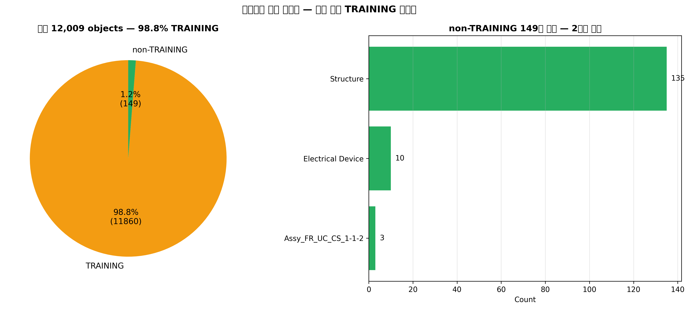
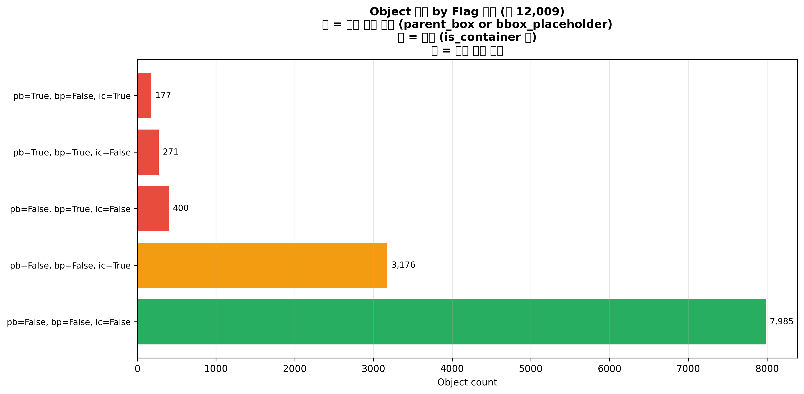
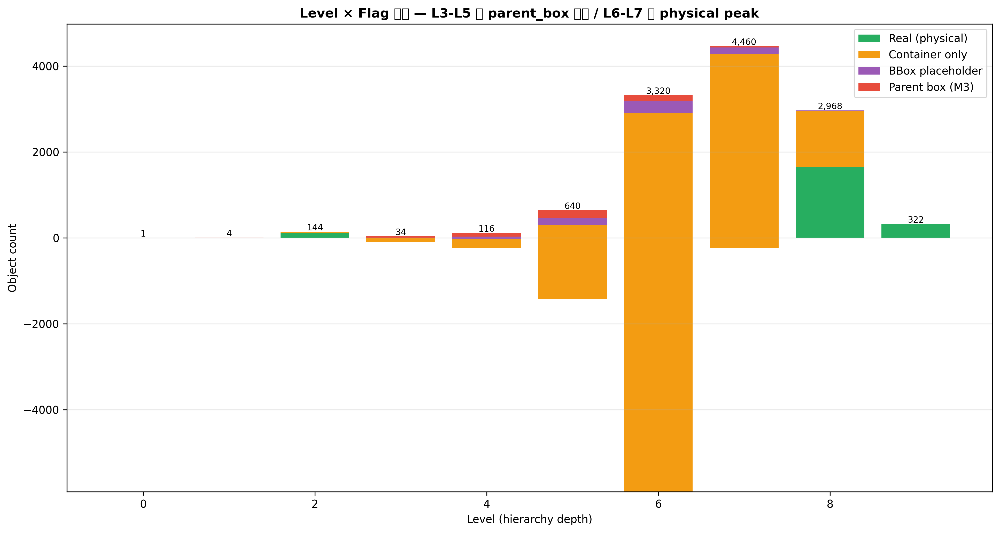
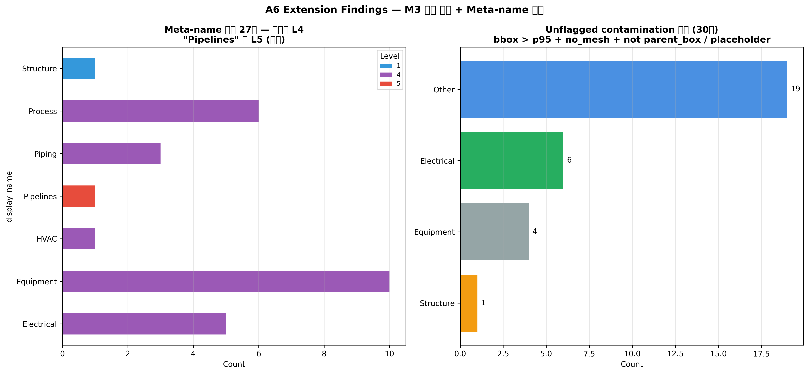

# A6 — Hierarchy Contamination Detection (M3 연장)

**작성일**: 2026-04-19
**재현**: `.venv/bin/python scripts/analysis_a6_contamination.py`
**로드맵**: [phase-4-deep-dive-roadmap.md](../plan/phase-4-deep-dive-roadmap.md) A6
**기반 finding**: [M3 parent box contamination](../findings/2026-04-13-M3-parent-box-contamination/README.md) (448 parent box 식별 완료)

---

## TL;DR

A6 에서 M3 finding 을 3 방향으로 연장:

1. **전체 dataset 이 DXTnavis TRAINING 튜토리얼 데이터 (98.8%)** — 12,009 중 11,860 이 `For Review.nwd > TRAINING` 경로. Non-TRAINING 은 149개 뿐 (135 Structure + 10 Electrical Device + 4 Assy). → 전체 분석 결과의 맥락을 재정의: production plant 가 아닌 training plant.
2. **추가 contamination 30 후보 발견**: M3 에서 flag 되지 않은 "bbox > p95 + no_mesh + not parent_box" 조합. Tank placeholder (T-001/002, TA-101, B-101 등) + Duct Banks_Conduit Run + WallSystem 들. 이들은 `is_container = True` 로 flag 되지만 `is_parent_box` 는 아님 → **M3 의 경계 케이스 확장**.
3. **"Pipelines" 메타-이름 = 유일한 L5 이상 징후**: 26개 meta-name 객체 (Equipment/Piping/Process 등) 가 모두 L4 (unit-level aggregator) 인데 "Pipelines" 혼자 L5 (pipe-name 위치) 에 있고 **153 piping component 가 `sp3d_pipeline="Pipelines"` 를 참조**. SP3D 원본에서 명명 실패.

---

## 1. 데이터셋 성격 재정의 — TRAINING 98.8%



| 영역 | 객체 수 | % |
|---|---:|---:|
| `For Review.nwd > TRAINING > ...` | **11,860** | 98.8% |
| `For Review.nwd > Structure` | 135 | 1.1% |
| `For Review.nwd > Electrical Device` | 10 | 0.08% |
| `Assy_FR_UC_CS_1-1-2` (assembly) | 3 | 0.02% |
| 기타 | 1 | — |

→ **전체 dataset 이 DXTnavis 튜토리얼 샘플 플랜트**. P-10147 이 TRN 접두를 가진 이유, SC-168 이 "TRAINING > Sulphur Recovery" 경로인 이유, 66% pipeline 이 pressure 미입력인 이유 — 전부 **training data 의 default 특성**.

**Portfolio 메시지**: "실제 운영 plant 데이터가 아니라 교육 목적의 완성 샘플" 이라는 맥락을 명시해두어야 분석 결과 오해 방지. 그러나 그럼에도 불구하고 **12K 객체 × 110K link 규모의 ontology 엔지니어링** + **AI FDE hallucination 검증 패턴 정립** 은 production 환경에 그대로 이식 가능.

---

## 2. Flag 조합 매트릭스



| parent_box | bbox_placeholder | is_container | Count | 해석 |
|:-:|:-:|:-:|---:|---|
| ❌ | ❌ | ❌ | **7,985** | 🟢 실체 물리 객체 (66.5%) |
| ❌ | ❌ | ✅ | **3,176** | 🟠 컨테이너 flag 만 (26.4%) — 판단 애매 |
| ❌ | ✅ | ❌ | 400 | 🔴 BBox placeholder only (3.3%) |
| ✅ | ✅ | ❌ | 271 | 🔴 parent_box + placeholder (2.3%) |
| ✅ | ❌ | ✅ | 177 | 🔴 parent_box + container (1.5%) |
| 합계 | | | 12,009 | 448 이 M3 flag |

**새 관찰**: **3,176 객체 (26.4%) 가 `is_container = True` but `is_parent_box = False`**. 이 중엔 진짜 컨테이너 (Module, Group 등) 도 있고, M3 경계 케이스도 있음. A1 에서 이 중 일부가 실제 clash 로 계산됐을 가능성 (parent_box 필터만 적용 → container 는 통과).

**권장**: A1 Clash 분석을 `is_container = False AND is_parent_box = False AND is_bbox_placeholder = False` 로 더 엄격 필터 재실행 — 후속 작업 대상.

---

## 3. Level × Contamination



| Level | Total | Real | Container only | Placeholder | Parent box | 해석 |
|---:|---:|---:|---:|---:|---:|---|
| 0 | 1 | 0 | 0 | 0 | 1 | Root (For Review.nwd) |
| 1 | 4 | 0 | 0 | 2 | 2 | Top-level (TRAINING, Structure) |
| 2 | 144 | 130 | 2 | 3 | 6 | Area level (A1, A2, A3) |
| 3 | 34 | 1 | 0 | 5 | 28 | 🔴 **Unit level — 82% parent_box** (U01~Uxx) |
| 4 | 116 | 16 | 16 | 0 | 86 | 🔴 **Sub-unit aggregator — 74% parent_box** (Equipment/Piping/Process) |
| 5 | 640 | ~304 | 167 | 0 | 171 | Mixed (plant / area / pipeline-name level) |
| **6** | **3,320** | **1,717** | **1,477** | 0 | 126 | 🟢 **Physical peak — 대부분 real 객체** |
| 7 | 4,460 | ~3,401 | 885 | 146 | 28 | Fittings / fine components |
| 8 | 2,968 | ~2,734 | 223 | 11 | 0 | Elements / fibers |
| 9 | 322 | 322 | 0 | 0 | 0 | Leaves (전원 real) |

### 해석
- **L3-L4 가 parent_box 집중구간** (82%, 74%) — Unit/Sub-unit aggregator
- **L6 가 physical peak** — 실제 부품 3,320 중 절반 (1,717) 이 real, 나머지 1,477 이 container-only
- **L6 container-only = 1,477 개** — A7 (고립 객체) 와 교차 분석 대상

---

## 4. Meta-name Drill-down



### 27 meta-name 객체 전수

| display_name | Count | 경로 패턴 | 판정 |
|---|---:|---|---|
| Equipment | 10 | `TRAINING > Ax > Uxx > Equipment` (L4) | ✅ 정상 L4 aggregator |
| Process | 6 | `TRAINING > Ax > Uxx > Process` (L4) | ✅ 정상 L4 aggregator |
| Electrical | 5 | `TRAINING > Ax > Uxx > Electrical` (L4) | ✅ 정상 L4 aggregator |
| Piping | 3 | `TRAINING > Ax > Uxx > Piping` (L4) | ✅ 정상 L4 aggregator |
| HVAC | 1 | `TRAINING > A2 > U05 > HVAC` (L4) | ✅ 정상 L4 aggregator |
| Structure | 1 | `For Review.nwd > Structure` (L1) | ✅ Top-level (non-TRAINING) |
| **Pipelines** | **1** | `TRAINING > A1 > U12 > Process > Pipelines` (**L5**) | ⚠️ **이상** |

### "Pipelines" 이상 상세
- 다른 26개 meta-name 은 L4 (unit > aggregator) 패턴 — 즉 "U01 의 모든 Equipment 묶음" 같은 형태
- `Pipelines` 는 **L5**, Process 컨테이너의 자식. 경로: `A1 > U12 > Process > Pipelines`
- 153개 piping component 가 `sp3d_pipeline = "Pipelines"` 를 참조 → **SP3D 원본에서 pipeline_name 필드가 "Pipelines" 문자열로 기록된 sample data**
- 각 component 의 `sp3d_pipe_run_name` 은 정상 (`U12-2-MZ-0045-1S3984` 같은 식별자)
- → **Pipeline level 명명은 누락됐지만 PipeRun level 은 정상** — A8 (PipeRun 흐름) 에서 재조명

### 30 unflagged contamination 후보 (bbox > p95 + no_mesh + NOT parent_box/placeholder)

| 그룹 | 예시 | 개수 |
|---|---|---:|
| Equipment tanks/vessels | Tank001A-E-1-0001, TA-101, B-101, 40V-101, T-001~302 | 12 |
| Electrical conduit bundles | Duct Banks_Conduit Run-1-105~123 | 6 |
| Wall/Structural systems | WallSystem-1-0001/0201/0202 | 3 |
| Other containers | 1001-P, P-10133, etc | 9 |

이들 전부 `is_container = True` + `has_real_mesh = False` + `adjacency_count = 0` — M3 criteria 에는 안 잡히지만 **실체 없는 컨테이너**. 향후 M3 확장 제안:

```python
M3_EXTENDED = (
    (is_parent_box)
    | (is_bbox_placeholder)
    | (is_container & ~has_real_mesh & bbox_volume_m3 > 20.0)
)
```

---

## 5. A 시리즈 교차 연결

| Finding | A6 기여 |
|---|---|
| A1 Clash ranking | 3,176 container-only 객체가 clash 결과에 섞여있을 수 있음 → 엄격 필터 재실행 제안 |
| A3 Physical hub | 30 unflagged 후보 중 Conduit 6개는 허브 아니라 빈 컨테이너 — A3 순위에선 이미 배제됨 (mesh 없음 → adj 0) |
| A5 Pipeline balancing | "Pipelines" 메타-이름 라인 → 153 components 가 `sp3d_pipeline="Pipelines"` 로 오분류. A8 PipeRun 분석에서 재조명 |
| A7 (다음) Isolated objects | 2,790 고립 중 이 unflagged 30 + container-only 3,176 어디 분포? |
| A8 (다음) PipeRun 흐름 | "Pipelines" 라인의 11 pipe_run 이 실제로 어떤 production 영역에 속하는지 확인 필요 |

---

## 6. 시사점

### 6.1 Data Contract 권장
Foundry Ontology 에 다음 computed property 추가 제안:

| Property | 정의 | 값 |
|---|---|---|
| `is_production` | `NOT system_path contains 'TRAINING'` | true for 149, false for 11,860 |
| `is_real_object` | `NOT (parent_box OR bbox_placeholder OR (container AND NOT has_real_mesh))` | true for ~7,500 |
| `contamination_score` | `(bbox_volume_m3 / p95) × (1 - has_real_mesh) × container` | 이상 감지 |

이 세 property 가 있으면 모든 downstream 분석이 **자동으로 데이터 품질 필터링** 됨.

### 6.2 AIP Function 시드

```python
def filter_real_objects(include_training: bool = False,
                        bbox_threshold: float | None = None) -> ObjectSet:
    """Return M3-extended real object set."""

def detect_meta_name_anomalies() -> list[Anomaly]:
    """Find objects with generic display_name at unexpected levels."""
```

### 6.3 DXTnavis 업스트림

"Pipelines" 가 SP3D 원본에서 pipeline_name 이 누락된 153개 sample — **DXTnavis Issue 제안 후보** (M1, M4 와 동일 패턴):

> "SP3D export 에서 pipeline_name 이 null/empty 인 경우 'Pipelines' 문자열로 fallback 하는 동작. 대신 null 유지 권장."

---

## 📁 산출물

- Markdown: 이 파일
- CSV: `data/analysis/a6_unflagged_contamination_candidates.csv` (30행), `a6_meta_name_objects.csv` (27행)
- Figures: `notebooks/figures/a6-contamination/01~04.png`
- Script: `scripts/analysis_a6_contamination.py`
