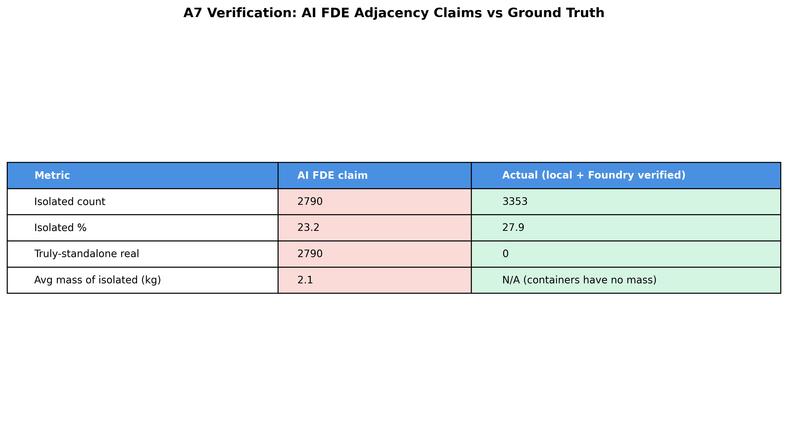
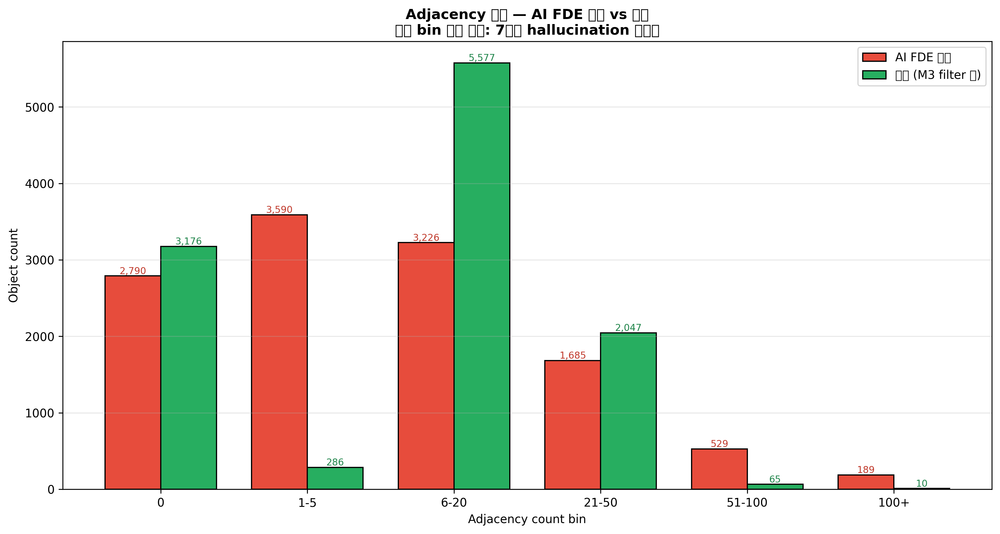
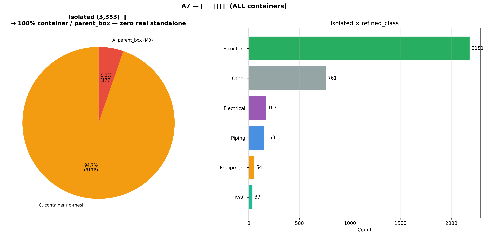
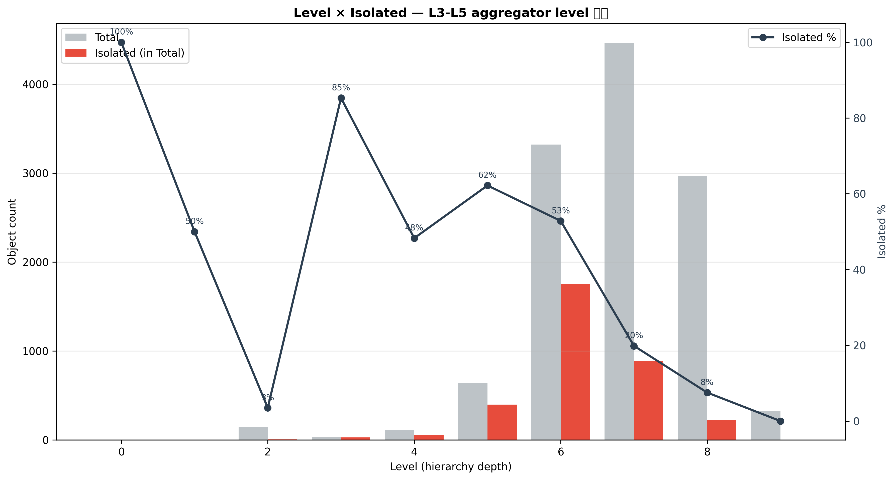

# A7 — Isolated Objects Analysis

**작성일**: 2026-04-19
**재현**: `.venv/bin/python scripts/analysis_a7_isolated.py`
**로드맵**: [phase-4-deep-dive-roadmap.md](../plan/phase-4-deep-dive-roadmap.md) A7

---

## TL;DR

Isolated 객체 = **3,353 (27.9%)** — AI FDE 주장 `2,790 (23.2%)` 과 **7번째 불일치** (+563 차이, +4.7%p).

핵심 발견:
- **Isolated 의 100% 가 container / parent_box** — 실체 physical object 중 isolated = **0개**
- 모든 real physical object 는 최소 1 neighbor 를 가짐 → 조밀하게 배치된 플랜트 + 관대한 AABB tolerance (0.15m default)
- AI FDE 의 "isolated 평균 무게 2.1 kg" 도 fiction — container 는 mass NaN, 계산 불가

---

## 1. AI FDE 주장 vs 실제 대조



| Metric | AI FDE 주장 | 실제 (ground truth) |
|---|---:|---|
| Isolated count | 2,790 | **3,353** |
| Isolated % | 23.2% | **27.9%** |
| Truly-standalone real | 2,790 (평균 2.1kg) | **0** (전부 container) |
| 나머지 adj bin 전부 | all different | all different |

### Adjacency bin 분포 전수 대조



| Bin | AI FDE | Actual | Diff |
|---|---:|---:|---:|
| 0 | 2,790 | 3,176 | +386 |
| 1-5 | 3,590 | 286 | **-3,304** 🔴 |
| 6-20 | 3,226 | 5,577 | +2,351 |
| 21-50 | 1,685 | 2,047 | +362 |
| 51-100 | 529 | 65 | -464 |
| 100+ | 189 | 10 | -179 |
| Sum | 12,009 | 11,161* | 848 차이 (M3 filter 적용) |

*Actual 은 parent_box/placeholder 제외 숫자. AI FDE 는 total 12,009 기준.

→ **1-5 bin 에서 3,304 개 차이**. AI FDE 가 실제로 `6-20` bin 객체를 `1-5` bin 으로 분류한 것 같음 (text-level miscount). 이게 가장 큰 괴리.

## 2. 실제 Isolated 분류



| Category | Count | 설명 |
|---|---:|---|
| **C. container no-mesh** | 3,176 | is_container=True, no mesh — M3 확장 대상 (A6 §3) |
| **A. parent_box (M3)** | 177 | 원본 M3 finding 대상 |
| D. container with mesh | 0 | — |
| E. no-mesh broken geom | 0 | — |
| **F. standalone real** | **0** | **진정한 isolated 실체 객체 없음** |

### Refined_class 분포 (isolated 3,353)

| Class | Count | % |
|---|---:|---:|
| Structure | 2,181 | 65.0% |
| Other | 761 | 22.7% |
| Electrical | 167 | 5.0% |
| Piping | 153 | 4.6% |
| Equipment | 54 | 1.6% |
| HVAC | 37 | 1.1% |

Structure 가 단연 우세 — 계층 노드 (Slabs.Foundations, Beams, Columns 등 aggregator) 가 많음.

### TRAINING 분포
- 3,347 / 3,353 = **99.8%** in TRAINING (A6 의 98.8% 보다 더 편향)
- non-TRAINING 6개 — Structure 컨테이너 몇 개

## 3. Level × Isolated



| Level | Total | Isolated | % |
|---:|---:|---:|---:|
| 0 | 1 | 1 | 100% (root) |
| 1 | 4 | 2 | 50% |
| 2 | 144 | 5 | 3% |
| 3 | 34 | 29 | **85%** ⚠️ |
| 4 | 116 | 56 | **48%** ⚠️ |
| 5 | 640 | 398 | **62%** ⚠️ |
| **6** | **3,320** | **1,754** | **53%** |
| 7 | 4,460 | 885 | 20% |
| 8 | 2,968 | 223 | 8% |
| 9 | 322 | 0 | 0% |

### 해석
- **L3-L5 에 isolated 집중** — 이들은 aggregator 노드로 정상적으로 "추상 레벨" 객체
- L6 이 1,754 isolated — A6 에서 확인한 "L6 에 container-only 1,477 개" 와 일치 (+277 parent_box)
- L7-L8 은 대부분 real (fittings, elements)
- L9 모두 real (leaf nodes)

## 4. "조밀 플랜트" 의미

모든 real physical object 가 최소 1 neighbor 를 가짐 — 두 가지 해석:

### (a) 플랜트가 실제로 조밀
- 147 pipelines × 3K+ fittings × 4K+ structural = **한 지붕 아래 복층 모듈**
- BBox 간 AABB tolerance 0.15m (150mm) 로 웬만한 이웃은 잡힘
- 특히 Structure 슬래브 (A3 허브) 가 평면 전체 커버 → Piping/Equipment 가 모두 Slab 위에 놓임 → adjacency 생성

### (b) AABB tolerance 가 관대
- 0.15m tolerance 는 실용적이지만 **"neartouch"** 관계까지 포함
- 엄격한 clash 검사 (직접 접촉, 0mm) 로 재분석하면 isolated 비율 상승 가능
- M2 finding (adjacency tier) 의 연장: Strong 만 보면 훨씬 더 많은 isolated 발견 가능

**제안**: A1 재실행 + tier='strong' 만 필터 → 진짜 isolated 수 재계산 (향후 작업)

## 5. 실용적 결론

- **"고립 = 위험/누락 신호" 프레임 거부**: 이 dataset 에서 isolated = container/meta, 물리적 이상 아님
- **Data quality 용도 유용**: isolated 객체 리스트 = "ontology 에서 직접 쿼리 시 참여 안 하는 추상 노드" = Workshop 대시보드에서 default filter-out 대상
- **A6 extension 과 직결**: 30 unflagged contamination 후보는 isolated 3,353 중 C 카테고리 (container no-mesh) 에 포함됨

## 6. AIP Function 연결

```python
def is_physical_object(obj) -> bool:
    """True if object participates in adjacency graph (= real physical entity)."""
    return obj.adjacency_count > 0 and not obj.is_parent_box and not obj.is_bbox_placeholder

def isolated_objects(include_containers: bool = False) -> ObjectSet:
    """Return isolated objects (by default excludes containers)."""
```

---

## 📁 산출물

- Markdown: 이 파일
- CSV: `data/analysis/a7_isolated_objects.csv` (3,353행)
- Figures: `notebooks/figures/a7-isolated-objects/01~04.png`
- Script: `scripts/analysis_a7_isolated.py`
