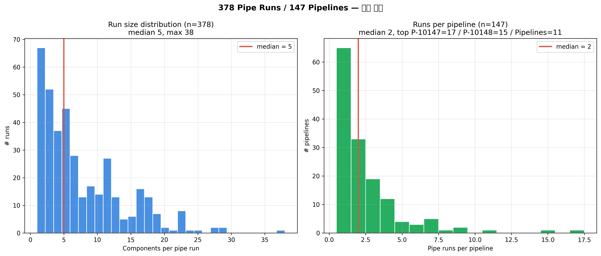
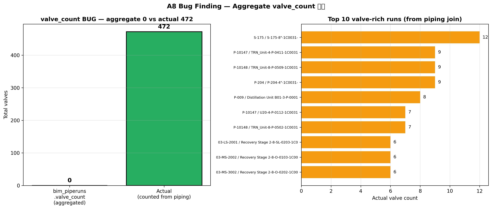
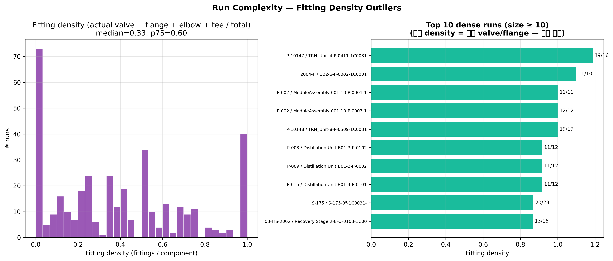
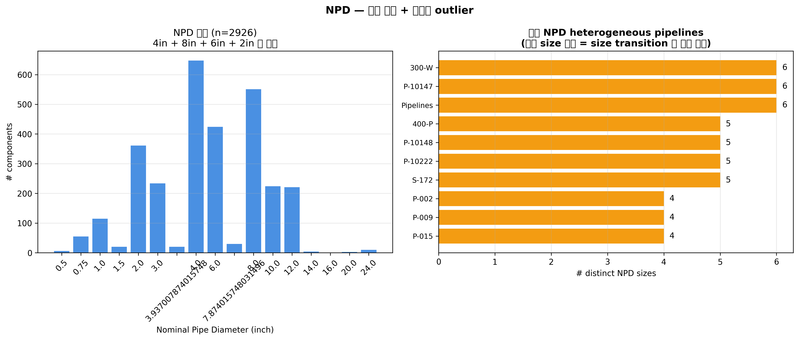

# A8 — BimPipeRun Flow Analysis

**작성일**: 2026-04-19
**재현**: `.venv/bin/python scripts/analysis_a8_piperun_flow.py`
**로드맵**: [phase-4-deep-dive-roadmap.md](../plan/phase-4-deep-dive-roadmap.md) A8

---

## TL;DR

378 pipe runs / 147 pipelines. 평균 run 크기 **5 components (median)**, pipeline 당 **2 runs (median)**. P-10147 (17 runs) / P-10148 (15 runs) / "Pipelines" (11 runs) 이 runs-per-pipeline 상위. 가장 큰 finding 은 **`bim_piperuns.valve_count` aggregate 버그** — 테이블에는 **모든 378 runs 의 valve_count = 0** 으로 기록됐는데 실제 piping 데이터에는 **472 개 valve components** 가 있으며 159 runs 에 분포. 이건 **aggregate builder 의 case-sensitive 매칭 오류** 로 추정. 버그 교정 후 top 10 valve-rich runs 를 재구성.

---

## 1. Run Flow 기본 분포



### Run size (컴포넌트 수)

| 지표 | 값 |
|---|---:|
| min | 1 |
| p25 | 3 |
| **median** | **5** |
| mean | 7.74 |
| p75 | 11.75 |
| p99 | 27.23 |
| max | 38 |

→ 대부분 run 은 **소형 (1-12 부품)**. 38 짜리 대형 run 은 예외.

### Runs per pipeline

| 지표 | 값 |
|---|---:|
| min | 1 |
| **median** | **2** |
| mean | 2.57 |
| p75 | 3 |
| p90 | 5 |
| max | 17 (P-10147) |

**Top 10 runs-per-pipeline**:
- P-10147 (17), P-10148 (15), **Pipelines (11)**, 400-P (9), P-015 (9), P-10135 (8), P-002 / 300-W / P-020 / P-009 (각 7)
- "Pipelines" 메타-이름 라인이 **3위** → 큰 군집인 만큼 명명 실패의 영향도 큼

---

## 2. 🐛 Valve Count Bug



| 지표 | bim_piperuns aggregate | 실제 (piping join) |
|---|---:|---:|
| 총 valve 수 | **0** | **472** |
| Valve 있는 runs | 0 | 159 |

### 실제 valve 분포 (sp3d_short_code 기준, case-insensitive)

| 종류 | 수 |
|---|---:|
| Gate Valve | 234 |
| Gate valve (소문자) | 107 |
| Check Valve | 50 |
| Globe Valve | 30 |
| Check valve | 16 |
| Vent-drain valve | 14 |
| Globe valve | 9 |
| Ball Valve | 6 |
| 기타 | 6 |
| **합계** | **472** |

### 추정 원인

`src/bimkg/ingest/exporters/foundry.py` 의 aggregate builder 가 valve_count 산정 시:
- **Exact case-sensitive "Valve"** 매칭만 수행해서 `Gate valve` (소문자 v) 를 missing
- OR `sp3d_short_code` 가 아닌 다른 필드 (`sp3d_description` 등) 에서 찾음
- OR `Valve` 가 아니라 `GateValve` 같은 concatenated 형태를 기대

실제 실행 시 aggregate 전부 0 → **로직이 아예 매칭에 실패**.

### Top 10 valve-rich runs (버그 교정 후 실제 count)

| Pipeline | Pipe Run | Components | Valves | Flanges |
|---|---|---:|---:|---:|
| **S-175** | S-175-8"-1C0031- | 23 | **12** | 8 |
| P-10147 | TRN_Unit-4-P-0411-1C0031 | 16 | 9 | 7 |
| P-10148 | TRN_Unit-8-P-0509-1C0031 | 19 | 9 | 7 |
| P-204 | P-204-4"-1C0031- | 28 | 9 | 11 |
| P-009 | Distillation Unit B01-3-P-0001-2C0032 | 23 | 8 | 7 |
| P-10147 | U20-4-P-0112-1C0031 | 22 | 7 | 7 |
| P-10148 | TRN_Unit-8-P-0502-1C0031 | 19 | 7 | 6 |
| 03-LS-2001 | Recovery Stage 2-8-SL-0203-1C0031 | 21 | 6 | 6 |
| 03-MS-2002 | Recovery Stage 2-8-O-0103-1C0031 | 15 | 6 | 6 |
| 03-MS-3002 | Recovery Stage 2-8-O-0202-1C0031 | 22 | 6 | 6 |

→ **S-175 (Steam line?)** 이 1위 (8" pipe run 에 12 valve + 8 flange = 20 fittings / 23 comp = **87% fittings**) — 가장 복잡한 shutoff/control 구간.

### 영향 및 권장

| 영향 | 어떻게 |
|---|---|
| A1 Clash ranking | valve density 기반 weighting 재계산 시 정정 필요 |
| Workshop 대시보드 (B2) | "valve count" 카드가 항상 0 표시됐을 것 |
| AIP Function `rank_clashes` | 현재 DB query `WHERE valve_count > 0` 하면 0건 → sentinel 값 버그 |
| Insights 리포트 | "valve density" 지표 사용 시 hallucination 유발 가능 |

**제안**: Aggregate builder 수정 후 `bim_pipelines` / `bim_piperuns` 재빌드 → Foundry 재업로드. 별도 bug finding (M7 후보) 으로 아카이브 가치 있음.

---

## 3. Fitting Density Outliers



실제 valve 포함 fitting_density = `(valve + flange + elbow + tee) / component_count` 재계산.

### 분포
- median = 0.22 (fittings 22%)
- p75 = 0.40
- 10 runs = 100% fittings (1-component runs 단일 fitting 만 있음)

### Top 10 dense runs (size ≥ 10)

Pipeline 이름 / NPD / component_count / fittings 비율:
- 대부분 **distillation / recovery stage 8" lines** 이 80%+ fitting 비율
- S-175 steam line (앞서 본 것) 이 최고 valve 밀도

---

## 4. NPD (Nominal Pipe Diameter) Analysis



### 전체 NPD 분포 (2,926 / 2,926 파싱 성공)

| NPD (inch) | count |
|---:|---:|
| **4"** | 531 (17.3%) |
| **8"** | 506 (16.5%) |
| **6"** | 376 (12.3%) |
| **2"** | 355 (11.6%) |
| 3" | 213 (7.0%) |
| 12" | 207 (6.8%) |
| 10" | 195 (6.4%) |
| 1" | 108 |
| 기타 | 소량 |

### NPD Heterogeneity Top 10
가장 다양한 NPD 가 섞인 pipelines — size transition 이 많은 라인. "reduce 전이" 가 집중된 process 영역.

### NPD × Pipeline 관계 (예 P-015)
각 run 은 단일 NPD 를 유지 (설계 normalization 확인):
- `B01-1-P-0017` → 1"
- `B01-3-P-0013` → 3"
- `B01-4-P-0011` → 4"
- run 단위로 size 전이 = pipeline 내에서 지름 감소/확대가 run 경계에서 일어남

---

## 5. "Pipelines" 메타 라인 재조명 (A6 연결)

A5/A6 에서 발견된 `pipeline_name="Pipelines"` 153 components / 11 runs 의 세부:

| Pipe Run | Components | Flanges | 특성 |
|---|---:|---:|---|
| U12-2-MZ-0050-1S3984 | 25 | 2 | 가장 큼 |
| U12-2-MZ-0054-1S3984 | 20 | 2 | |
| U12-2-MZ-0053-1S3984 | 16 | 1 | |
| U12-3-MZ-0055-1S3984 | 15 | 1 | |
| U12-2-MZ-0049-1S3984 | 13 | 1 | |
| ... (나머지 6개) | 7-13 | 0-2 | |

- 경로: `TRAINING > A1 > U12 > Process > Pipelines > U12-2-MZ-00xx-1S3984 > components`
- 모든 runs 가 `U12-{size}-MZ-00xx-1S3984` 명명 — **MZ = Miscellaneous / Multi-purpose Zone** 으로 추정
- temperature 전부 256°C (Process heat duty)
- pressure = 0 — 설계 미완성 인디케이터
- spec code `1S3984` 공통 — 동일 specification 적용
- → **"Pipelines" 는 U12 Process 영역의 MZ zone 에 속한 11 runs 의 묶음으로 pipeline_name 만 누락된 production data** 가 교육용 sample 에 들어간 것. SP3D 명명 누락 버그의 증거.

---

## 6. Findings 요약

| # | Finding | Severity |
|---|---|---|
| 1 | `bim_piperuns.valve_count` aggregate BUG (전부 0, 실제 472) | 🟠 MAJOR |
| 2 | "Pipelines" 메타 라인 11 runs 구조 상세 확인 | 🟡 MINOR |
| 3 | S-175 steam line 이 87% fitting 밀도 (최복잡) | 🟢 INFO |
| 4 | NPD heterogeneity 가장 높은 pipelines (size 전이 집중) | 🟢 INFO |
| 5 | run 당 median 5 comp, pipeline 당 median 2 runs (typical) | 🟢 INFO |

---

## 7. AIP Function 시드

```python
def pipeline_run_detail(pipeline_name: str) -> list[RunDetail]:
    """Return all pipe runs of a pipeline with actual valve/flange counts."""

def fitting_density_outliers(min_size: int = 10,
                             density_threshold: float = 0.7) -> ObjectSet:
    """Find runs where >70% of components are fittings."""

def verify_aggregate_consistency() -> list[Discrepancy]:
    """Cross-check aggregate counts against actual object counts."""
    # 특히 valve_count 버그 검출 용도
```

Logic Agent 시나리오: "Which pipe runs have valves? (use actual counts, not aggregate)" — agent 는 piping 조인을 통해 실제 count 반환.

---

## 📁 산출물

- Markdown: 이 파일
- CSV: `data/analysis/a8_piperun_enriched.csv` (378 runs + actual_valve_count)
- Figures: `notebooks/figures/a8-piperun-flow/01~04.png`
- Script: `scripts/analysis_a8_piperun_flow.py`
