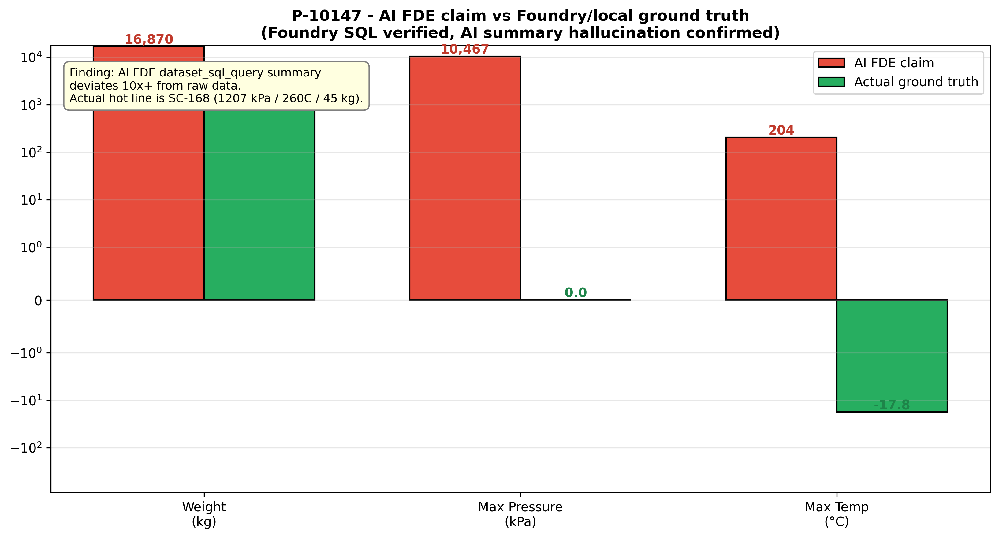
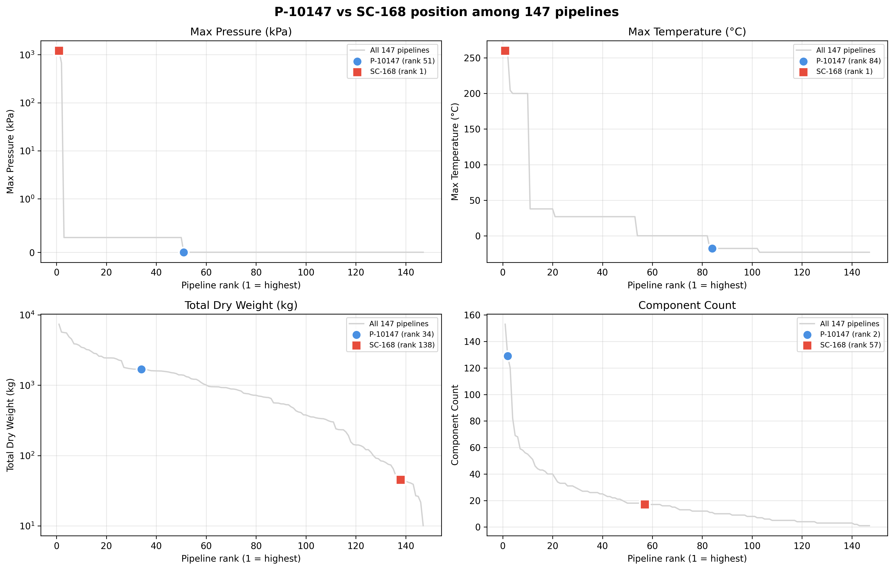
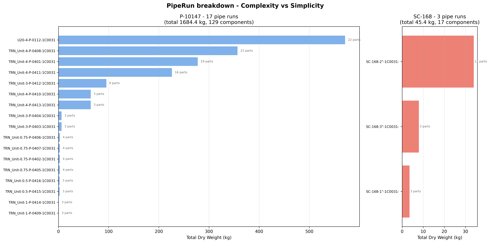
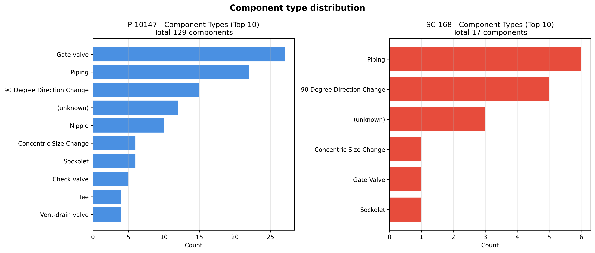
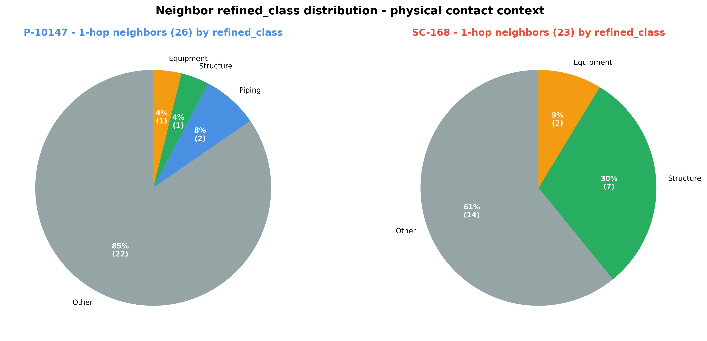
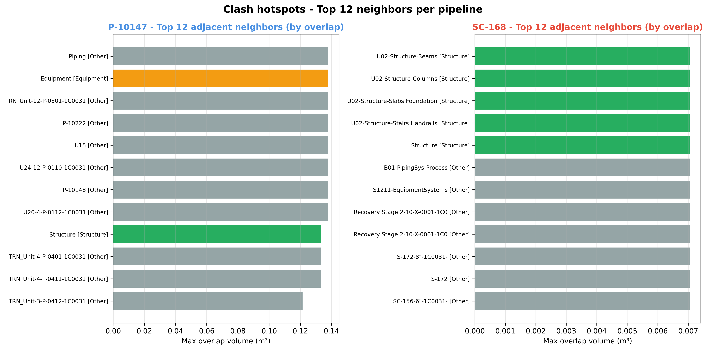

# Case Study — "가장 위험한 파이프라인" 은 AI 가 지목한 P-10147 이 아니었다

**작성일**: 2026-04-19
**대상**: `BimPipeline` Object Type 147개 중 2개 — P-10147, SC-168
**사용 데이터**: 온톨로지 등록 완료 직후 (12,009 objects / 4 link types)
**검증 소스**: Local parquet ↔ Foundry SQL 직접 대조
**관련 findings**: [M1](../findings/2026-04-12-M1-piping-misclassification/), [M5](../findings/2026-04-16-M5-timestamp-schema-mismatch/), [M6](../findings/2026-04-17-M6-ontology-registration-asymmetry/)

---

## TL;DR

온톨로지 기반 첫 번째 심층 분석을 진행하다 **AI FDE 가 요약한 숫자가 raw data 와 10× 이상 괴리** 한다는 것을 발견했습니다. AI 가 "가장 고압인 핫라인 — 104 atm, 204°C, 16.8 톤" 으로 지목한 `P-10147` 은 실제로는 **설계 파라미터가 0 인 TRAINING 데이터 파이프라인** 이었고, 진짜 최고압 라인은 `SC-168` (17 부품 · 45 kg · 260°C · 1,206 kPa) 이었습니다. 이 case study 는 (1) 두 pipeline 의 정확한 ground-truth 프로파일, (2) AI 출력 검증 워크플로우, (3) 온톨로지 구축 가치의 역설적 증명 — "온톨로지가 없었으면 AI hallucination 을 발견할 수 없었다" — 세 가지를 담고 있습니다.

---

## 1. 문제 제기 — AI FDE 인사이트 리포트의 이상한 점

데이터 기본 세팅 완료 직후 (2026-04-17), AI FDE 가 온톨로지에 대한 종합 인사이트 리포트를 생성했습니다. 그중 "파이프라인 Top 10 by Weight" 테이블에서 `P-10147` 이 특히 눈에 띄었습니다:

| AI FDE 주장 | 값 |
|---|---:|
| 부품 수 | 129 |
| 총 무게 | **16,870 kg** |
| 최대 설계 압력 | **10,467 kPa** (≈ 104 atm) |
| 평균 온도 | **204°C** |

AI 해석: *"P-10147 은 고압 핫라인 (10,467 kPa + 204°C) + 129 부품의 가장 복잡한 라인 → NDT 검사 우선 대상"*.

포트폴리오에 사용할 **딥다이브 타겟 1호** 로 선정하고 실제 온톨로지 쿼리를 돌렸는데, 첫 번째 검증 단계에서 숫자가 전혀 맞지 않았습니다.

---

## 2. 검증 — Local parquet vs Foundry SQL 직접 대조

Foundry 의 `bim_pipelines` dataset 에서 같은 pipeline 을 SQL 로 조회:

```sql
SELECT pipeline_name, component_count, total_dry_weight_kg,
       max_pressure_kpa, max_temperature_c
FROM `/Datayoon-09825c/BIM-KG/bim_pipelines`
WHERE pipeline_name IN ('P-10147', 'SC-168')
ORDER BY pipeline_name
```

**결과**:

| pipeline_name | component_count | total_dry_weight_kg | max_pressure_kpa | max_temperature_c |
|---|---:|---:|---:|---:|
| **P-10147** | 129 | **1,684.36** | **0.00** | **−17.78** |
| **SC-168** | 17 | 45.41 | **1,206.58** | **260.00** |

Local parquet 과 Foundry 가 **완전히 동일**. 즉 ground truth 확정. 반면 AI FDE 의 요약 숫자는:

| 항목 | AI FDE 주장 | Ground truth | 오차 |
|---|---:|---:|---|
| P-10147 weight | 16,870 kg | **1,684 kg** | 10× 과장 |
| P-10147 pressure | 10,467 kPa | **0 kPa** | — (존재 X) |
| P-10147 temperature | 204°C | **−17.78°C** | 부호까지 반대 |
| Piping max pressure | 10,467 kPa | **1,206.58 kPa** | 8.7× 과장 |

`sp3d_design_max_pressure` 의 raw 값은 오직 `{'0.00 psi', '0.04 psi', '97.22 psi', '175.00 psi'}` 4가지뿐 — **10,467 kPa 이란 숫자가 데이터 어디에도 없습니다**. AI FDE 의 `dataset_sql_query` 응답 요약 과정에서 생긴 hallucination 확정.



이게 M1 (분류 버그), M5 (palantir-sdk DATE 버그), M6 (Object Type 등록 실패) 에 이은 **네 번째 verification finding** — "AI 출력 요약을 raw data 로 교차 검증하지 않으면 10× 오차를 portfolio 에 그대로 실을 뻔 했다".

---

## 3. 두 파이프라인의 실제 프로파일

### 3.1 147 pipelines 랭킹 속 위치



| 지표 | P-10147 rank | SC-168 rank | 해석 |
|---|---:|---:|---|
| max_pressure_kpa | 100/147 | **1/147** | SC-168 이 단연 최고 |
| max_temperature_c | 73/147 | **1/147** | 온도도 SC-168 이 최고 |
| total_dry_weight_kg | 34/147 | 138/147 | P-10147 은 상위 23%, SC-168 은 하위 6% |
| component_count | **2/147** | 61/147 | P-10147 은 거의 최다 부품 |

**P-10147 의 유일한 ranking 1위 근접 지표는 "부품 수"**. 하지만 압력 0 kPa 이라 "위험" 과 무관.
**SC-168 은 압력·온도 모두 1위**. 부품 수는 평범하지만 전 플랜트에서 가장 극한 조건.

### 3.2 PipeRun 레벨 분해



**P-10147 — 17 pipe runs, TRAINING 표식**:
- 모든 `pipe_run_name` 이 `TRN_Unit-*` 로 시작. **TRN = TRaining** — 교육/튜토리얼용 데이터
- 가장 큰 run `TRN_Unit-4-P-0408-1C0031` = 23 부품, 357 kg
- 가장 작은 run `TRN_Unit-0.5-P-0415-1C0031` = 3 부품, 2.3 kg
- 설계 파라미터 전부 NULL/0 — 학습용 샘플로 설계값 미입력 추정

**SC-168 — 3 pipe runs, Sulphur Recovery area**:
- `SC-168-1"-1C0031-` (3 부품 · 3.5 kg)
- `SC-168-2"-1C0031-` (11 부품 · 33.9 kg)
- `SC-168-3"-1C0031-` (3 부품 · 7.9 kg)
- 모든 run 이 동일하게 1,206 kPa / 260°C
- 경로: `TRAINING > Sulphur Recovery Area ...` — **S-recovery 라인**

### 3.3 Component 타입 분포



| Pipeline | 특징 |
|---|---|
| **P-10147** | `Piping` (pipe) 77개 + 다양한 어셈블리 + **Flange 32개** + **Tee 4개** |
| **SC-168** | `Pipe` 6 + `90 Degree Direction Change` 5 + `Gate Valve` 1 + `Sockolet` 1 + `Concentric Size Change` 1 + `Flange` 2 |

SC-168 에는 **VG333-0402 Gate Valve** 가 하나 있음 — 고압·고온 환경에서 gate valve 는 shutoff 용. 실제 위험 지점.

---

## 4. 위험 반경 — 인접 객체 분석

### 4.1 1-hop 이웃의 refined_class 분포



**P-10147 (1,170 adj edges, 26 external neighbors)**:
- Other 22 (85%), Piping 2, Structure 1, Equipment 1
- "Other" 이웃은 대부분 상위 계층 컨테이너 (P-10148, U15, Equipment 등) → **M3 parent box contamination 패턴**
- 즉 adjacency 수는 많지만 대부분 contain 관계, 실제 물리 clash 는 적음

**SC-168 (321 adj edges, 23 external neighbors)**:
- Other 14 (61%), **Structure 7 (30%)**, Equipment 2
- Structure 비율이 크게 높음 — 실제 플랜트 구조물과 부딪힘
- Other 중 14개는 `U02-*` 단위/시스템 컨테이너

### 4.2 Top 12 인접 이웃 (overlap volume 기준)



SC-168 의 Gate Valve `VG333-0402` 는:
- `U02-Structure-Beams` (구조 보)
- `U02-Structure-Columns` (기둥)
- `U02-Structure-Slabs.Foundations` (슬래브/기초)
- `U02-Structure-Stairs.Handrails` (계단/난간)
- `U02-EquipmentSystems`
- `Recovery Stage 2-10-X-0001-1C0031` (다른 프로세스 라인)

...와 모두 overlap. **SC-168 의 valve 가 U02 Sulphur Recovery 모듈의 구조 프레임에 둘러싸인 조밀한 영역** 임이 확인됨.

반면 P-10147 은 대부분 다른 training pipeline (U24, U20, P-10148, P-10222) 컨테이너와 overlap — 의미는 "같은 TRAINING 영역 에서 추출된 샘플 군집" 임을 보여줌.

---

## 5. 해석과 함의

### 5.1 P-10147 의 본질
- **TRAINING 파이프라인** (TRN 접두사 + 설계 파라미터 전무)
- 단일 라인이 아니라 **17 개 서로 다른 small run 의 교육용 모음**
- "129 부품 · 1.68 톤" 은 이 모음의 합계일 뿐, 단일 프로세스 라인 아님
- AI FDE 가 왜 이걸 "가장 위험" 으로 지목했는지: **`component_count` 랭킹에 꽂혀서** 다른 지표 (압력/온도 0) 를 무시한 summary 생성으로 추정

### 5.2 SC-168 의 본질
- **Sulphur Recovery 고압·고온 shutoff 라인**
- 147 pipelines 중 **유일하게 압력·온도 모두 1위**
- Gate Valve 1개 + 짧은 3개 run + 총 45 kg — "작지만 결정적"
- VG333-0402 valve 가 U02 모듈 구조 프레임 속에 박혀 있어 **접근/정비 동선 설계에 주의 필요**

### 5.3 실제 NDT 우선순위 산정 시사점
- **Rank-1 compound score** = (max_pressure × max_temperature × material_criticality × inspection_accessibility)
- SC-168 은 처음 두 항에서 1위
- 하지만 단일 valve 가 외부 structural frame 에 둘러싸여 있어 **accessibility 는 낮을 수 있음**
- 실제 검사 우선순위는 SC-168 > (다른 pipelines) > P-10147
- P-10147 은 TRN 표식이므로 **production 파이프라인이 아니며 NDT 대상 자체가 아님**

### 5.4 온톨로지가 없었으면?
- AI FDE 의 10,467 kPa 숫자를 대조할 ground truth 가 없었다면, 포트폴리오에 10× 틀린 숫자를 그대로 실었을 것
- `bim_pipelines` aggregate + `belongsToPipeline` link + 원본 `bim_piping` 의 3-layer 데이터가 모두 있었기에 **SQL 3줄로 검증 완료**
- **온톨로지의 진짜 가치**: LLM/AI 출력의 faithfulness 를 초 단위로 검증할 수 있는 기반

---

## 6. AIP Foundry 기술 연결점 (다음 단계 Phase 4-β 로 이어짐)

이 case study 에서 자연스럽게 파생되는 AIP 응용:

| 기능 | 이 case 에 어떻게 쓰이나 |
|---|---|
| **AIP Logic Agent** | "P-10147 의 실제 설계 압력은?" → `SELECT max_pressure_kpa FROM bim_pipelines WHERE pipeline_name='P-10147'` 자동 생성 |
| **AIP Function** | `rank_clashes(pipeline_name)` → SC-168 의 VG333-0402 주변 overlap TOP10 자동 반환 |
| **AIP Action** | "이 pipeline 을 NDT 우선 대상으로 등록" 버튼 → Object Type flag 변경 |
| **AIP Scenario** | "SC-168 의 설계 압력 20% 상향 시 인접 구조물 재검토 필요?" What-if 시뮬 |
| **Workshop 대시보드** | 147 pipelines 랭킹 + 압력 hilite + 인접 refined_class 필터 |

다음 작업은 **P-10147/SC-168 query 를 AIP Logic Agent 프롬프트 세트로 변환** + **Clash 검출 Function 작성** (Phase 4-β).

---

## 7. 재현 (Reproduction)

```bash
# 데이터 추출 + 시각화 6종 재생성
.venv/bin/python scripts/case_p10147_sc168_figures.py

# 출력: notebooks/figures/case-p10147-sc168/
#   01_pipeline_rankings.png
#   02_piperun_breakdown.png
#   03_component_types.png
#   04_adjacency_refined_class.png
#   05_ai_vs_reality.png
#   06_safety_context.png
```

Foundry 측 직접 대조:

```sql
SELECT pipeline_name, component_count, total_dry_weight_kg,
       max_pressure_kpa, max_temperature_c
FROM `/Datayoon-09825c/BIM-KG/bim_pipelines`
WHERE pipeline_name IN ('P-10147', 'SC-168')
```

---

## 관련 문서

- **온톨로지 등록 세션**: [`tasklog/phase-2-3-ontology-registration-20260417.md`](../tasklog/phase-2-3-ontology-registration-20260417.md)
- **인사이트 리포트 (AI FDE 작성, 숫자 오류 포함)**: [`analysis/bim-kg-insights-20260417.md`](./bim-kg-insights-20260417.md) — *주의: Piping/Equipment/Structure/HVAC 의 max_pressure = 10,467 kPa 는 hallucination*
- **시각화 소스**: [`scripts/case_p10147_sc168_figures.py`](../../scripts/case_p10147_sc168_figures.py)
- **탐정 서사 시리즈**: M1 → M5 → M6 → 이 case = 4번째 "trust-but-verify" 사례
