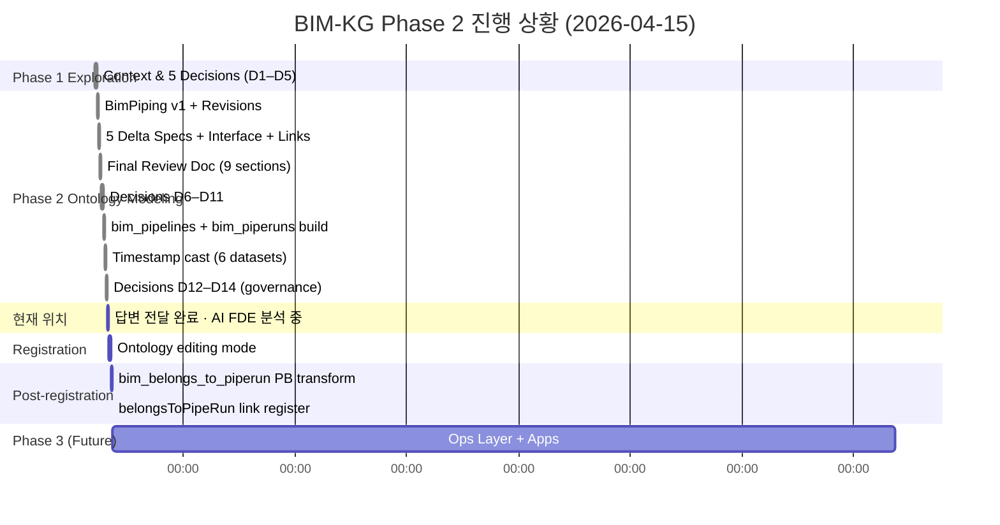
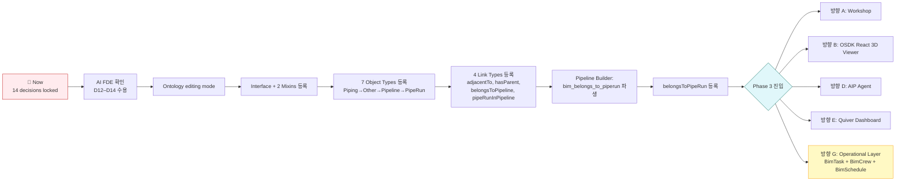

# BIM-KG Decision Journey

**Date**: 2026-04-15
**Scope**: 하루 세션 전체의 의사결정 흐름 (Foundry Ontology 설계 과정)
**Purpose**: "무슨 질문이 왔고 → 어떻게 판단했고 → 어떤 결과/다음 단계로 이어졌는지" 를 시각적으로 정리

---

## 🗺️ Journey Overview (한 장 요약)

```mermaid
flowchart TD
    Start([2026-04-15 Morning<br/>11 datasets uploaded<br/>Ontology 미구성]) --> P1{Phase 1<br/>Data Exploration}

    P1 --> D1["D1: Object Type 구조<br/>6 separate + Interface"]
    D1 --> D2["D2: Pipeline/Zone 승격<br/>Pipeline YES<br/>Group/Zone DEFER"]
    D2 --> D3["D3: 비물리 객체 필터링<br/>전체 포함 + Object Set"]
    D3 --> D4["D4: Adjacency tier<br/>단일 link + property"]
    D4 --> D5["D5: 앱 우선순위<br/>3D Viewer + Pipeline Inspector"]

    D5 --> P2{Phase 2<br/>Ontology Modeling}

    P2 --> D6["D6: PipeRun 승격<br/>BimPipeRun Object Type<br/>🔄 D2 결정 뒤집기"]
    D6 --> D7["D7: Timestamp cast<br/>8 datasets ingested_at_utc"]
    D7 --> D8["D8: HasPressureTemp<br/>Piping-only<br/>⚠️ Phase 1 가정 수정"]
    D8 --> D9["D9: nav_item_guid<br/>M1 forensic trail<br/>🆕 새 발견"]
    D9 --> D10["D10: Phase 3 로드맵<br/>방향 G 등재<br/>🔜 operational layer"]
    D10 --> D11["D11: Mixin 최소주의<br/>HasLinearExtent 기각<br/>HasMaterialProperties 기각"]

    D11 --> Disc{{"3 Discrepancies 발견"}}

    Disc --> D12["D12: 용어 분리<br/>BIM pipeline ≠ Pipeline Builder"]
    D12 --> D13["D13: Raw data 불변<br/>Pipeline Builder 의무<br/>⚠️ cast_timestamp 사후원칙화"]
    D13 --> D14["D14: 3 Discrepancy triage<br/>KPI defer<br/>Date 수용<br/>piperun_id Pipeline Builder"]

    D14 --> Now([🔴 현재 위치<br/>답변 전달 완료<br/>AI FDE 분석 중])
    Now --> Future{Ontology Registration}
    Future --> Phase3((Phase 3<br/>Apps + Ops Layer))

    style Start fill:#E3F2FD,stroke:#1565C0
    style Now fill:#FFEBEE,stroke:#C62828,stroke-width:3px
    style P1 fill:#F3E5F5,stroke:#6A1B9A
    style P2 fill:#F3E5F5,stroke:#6A1B9A
    style Disc fill:#FFF3E0,stroke:#E65100
    style Future fill:#E8F5E9,stroke:#2E7D32
    style Phase3 fill:#E0F7FA,stroke:#00695C
```



---

## 🔍 결정 상세 (14개 카드)

각 결정을 **Question → Alternatives → Judgment → Outcome → Unlocks** 형식으로 정리.

---

### D1: Object Type 구조 (Phase 1)

```
❓ QUESTION
  6개 dataset 모두 ~200컬럼 동일 스키마. 어떻게 모델링?

🔀 ALTERNATIVES
  (A) 단일 BimObject + refined_class 필터    ← 기각
  (B) 6개 분리 Object Type + Interface        ← 채택
  (C) Hybrid (단일 + View)                    ← 기각 (AI FDE 권장이었으나)

✅ JUDGMENT
  219 cols sparsity (Piping 의 pressure 77%, 그 외 0%) →
  단일 type 은 property list 가 너무 sparse.
  도메인 의미가 분명: operator 는 "piping" vs "equipment" 구분.

📊 OUTCOME
  6 Object Types + Interface 설계 진행
  Cross-type 쿼리는 Interface 로 해결

🔓 UNLOCKS
  → Phase 2 에서 6 delta spec 작성 가능
  → Interface 에 공통 property 34개 집약 가능
```

---

### D2: Pipeline / Zone 승격 (Phase 1)

```
❓ QUESTION
  bim_belongs_to_pipeline, bim_in_group 은 link-like.
  Pipeline (147), Zone (144), Group (3,355) 를 1급 Object Type 으로 만들까?

🔀 ALTERNATIVES
  (a) 전부 Object Type                      ← 기각 (Zone 데이터 없음)
  (b) 전부 Link Type property 로만          ← 기각 (쿼리 불편)
  (c) Pipeline YES, Zone/Group DEFER        ← 채택

✅ JUDGMENT
  - Pipeline 147: "Show pipeline P-10147" 쿼리 빈도 높음
  - Group 3,355: 99.9% singleton → Object Type 승격 가치 낮음
  - Zone 144: 아직 업로드 안 됨 → Phase 3 에서 재검토

📊 OUTCOME
  BimPipeline 추가, Group/Zone 는 Link property/미래 작업

🔓 UNLOCKS
  → 147 × 20+ KPI 집계 가능해짐
  → Phase 3 operational layer 의 base 엔티티 확보
  → (D6 에서 PipeRun 도 비슷한 논리로 승격됨)
```

---

### D3: 비물리 객체 필터링 (Phase 1)

```
❓ QUESTION
  container, bbox_placeholder, parent_box, hidden 을 Ontology 에 포함?

🔀 ALTERNATIVES
  (a) 전체 포함 + 런타임 필터               ← 채택
  (b) Dataset layer 에서 제외               ← 기각

✅ JUDGMENT
  - M3 의 `is_parent_box` flag 는 의도적 보존
  - Dataset 에서 제거 = irreversible, Object Set 필터 = reversible
  - Workshop/OSDK 가 Object Set bookmark 지원

📊 OUTCOME
  12,009 전부 Ontology 포함
  "PhysicalObjectsOnly" 같은 Object Set 은 Phase 3 생성

🔓 UNLOCKS
  → 계층 관계 (bim_has_parent) 가 완전 보존
  → M3 audit trail 을 Ontology 쿼리로 접근 가능
```

---

### D4: Adjacency tier 처리 (Phase 1)

```
❓ QUESTION
  110K edges, 3 tiers (overlap/touch/neartouch). 어떻게 모델링?

🔀 ALTERNATIVES
  (a) 단일 link + relation_type property    ← 채택
  (b) 3개 분리 link type                    ← 기각
  (c) Strong 만 노출                        ← 기각

✅ JUDGMENT
  - 110K edges 는 Foundry 기준 가볍다 (10M+ 사례 존재)
  - M2 의 3 tier 는 analytics concept, schema concept 아님
  - relation_type 으로 WHERE 필터 가능

📊 OUTCOME
  1개 `adjacentTo` Link + 5개 link-level properties

🔓 UNLOCKS
  → Phase 3 spatial analytics 가 flexible
```

---

### D5: 앱 우선순위 (Phase 1)

```
❓ QUESTION
  5개 use case 중 어디부터? (3D Viewer / Pipeline Inspector / Spatial
  Analytics / Construction / Zone Analysis)

🔀 ALTERNATIVES
  (a) 전부 Phase 2                          ← 기각 (범위 폭발)
  (b) 3D Viewer only                        ← 기각 (demo 단조)
  (c) 3D + Pipeline 우선, 나머지 Phase 3    ← 채택

✅ JUDGMENT
  - 3D Viewer = wow factor
  - Pipeline Inspector = domain 가장 흔한 workflow
  - Zone Analysis 는 나머지 위에 build 하는 구조

📊 OUTCOME
  Phase 2 registration 은 3D + Pipeline 우선 순위
  Zone Analysis 는 Phase 3 마지막

🔓 UNLOCKS
  → mesh_uri 를 Media Reference 로 반드시 처리 (D-AIFDE-2 Part C)
  → BimPipeline 승격의 정당성 보강
```

---

### D6: PipeRun 승격 (Phase 2) 🔄

```
❓ QUESTION
  PipeRun 을 1급 Object Type 으로? (Phase 1 D2 에서 DEFER 결정했던 것)

🔀 ALTERNATIVES
  (a) D2 유지 (link property 로만)          ← 기각
  (b) Phase 3 로 연기                       ← 기각
  (c) Phase 2 에 포함 (D2 번복)             ← 채택

✅ JUDGMENT
  사용자: "pipeline, piperun 은 플랜트 산업 표준 연결단위.
         공사 관리가 PipeRun 단위로 이뤄짐."
  - 운영 데이터 (Phase 3) 의 기본 단위임을 확인
  - 지금 추가 비용 15분 < 나중 재작업 비용

📊 OUTCOME
  BimPipeRun Object Type 추가 (378 entities)
  bim_piperuns dataset 생성 및 업로드
  Phase 1 D2 결정 공식 번복

🔓 UNLOCKS
  → Phase 3 BimTask 가 PipeRun 단위로 attach 가능
  → 공사 진척률 계산 가능 (PipeRun → Task → completion)
```

---

### D7: Timestamp Cast (Phase 2)

```
❓ QUESTION
  ingested_at_utc 를 String ISO 로 둘까, datetime cast 할까?

🔀 ALTERNATIVES
  (a) String 유지                           ← 기각 (시계열 쿼리 불가)
  (b) datetime64[ns, UTC] cast              ← 채택

✅ JUDGMENT
  Foundry time-series 쿼리 가능해짐, 비용은 re-upload 한 번.

📊 OUTCOME
  scripts/cast_timestamp_columns.py 작성, 6 datasets 재업로드
  ⚠️ 사후 판단: 이 재업로드 자체가 "원본 수정" → D13 에서 원칙화

🔓 UNLOCKS
  → "최근 7일 재처리된 객체" 쿼리 가능
  → Phase 3 operational layer 에서 task timestamp 와 통합 쉬움

⚠️ LEARNING
  이 작업을 Pipeline Builder 로 했어야 함 (D13 참고)
```

---

### D8: HasPressureTemp Scope 축소 (Phase 2)

```
❓ QUESTION
  HasPressureTemp mixin 을 Piping + Equipment 에 적용?

🔀 ALTERNATIVES
  (a) Phase 1 가정 유지 (Piping + Equipment) ← 기각
  (b) Piping-only                            ← 채택

✅ JUDGMENT
  AI FDE 가 데이터 검증:
    Equipment design_pressure_kpa fill = 0%
    Equipment design_temperature_c fill = 0%
  → 우리의 Phase 1 가정이 데이터로 부정됨

📊 OUTCOME
  HasPressureTemp = Piping-only mixin
  Equipment 는 구현 안 함

🔓 UNLOCKS
  → DXTnavis PR 후보: Equipment pressure/temp export 추가
  → Phase 3 에서 Equipment 분석 시 이 제약 명시

⚠️ LEARNING
  Phase 1 의 intent-level 가정은 Phase 2 데이터 검증 필수
```

---

### D9: nav_item_guid 보존 (Phase 2) 🆕

```
❓ QUESTION
  nav_item_guid 는 object_id 와 중복 아닌가?

🔀 ALTERNATIVES
  (a) 제거 (중복으로 판단)                   ← 기각
  (b) 유지                                   ← 채택

✅ JUDGMENT
  AI FDE 쿼리:
    SELECT COUNT(*) FROM bim_piping
    WHERE object_id != nav_item_guid
    = 136
  🎯 정확히 M1 의 LIKELY_BUG 객체 수 (136)
  → M1 재분류 시 object_id 재할당됐지만,
    nav_item_guid 는 Navisworks 원본 GUID 보존
  → 감사 증거 (forensic trail)

📊 OUTCOME
  nav_item_guid 를 Tier 4 (Navisworks metadata) 에 유지
  M1 finding archive 에 cross-reference 필요

🔓 UNLOCKS
  → M1 영향 받은 객체를 추후 추적 가능
  → Data quality audit 스토리가 Ontology 에서 surfacable

🌟 NEW DISCOVERY
  우리가 M1 archive 할 때 놓친 구조적 의미
```

---

### D10: Phase 3 Operational Layer 로드맵 등재 (Phase 2) 🔜

```
❓ QUESTION
  공사 관리 속성 (소요일, 완료율, 비용, 인력) 을 지금 추가?

🔀 ALTERNATIVES
  (a) Phase 2 에 포함                       ← 기각 (범위 폭발)
  (b) 현재는 무시                           ← 기각 (맥락 손실)
  (c) Phase 3 방향 G 로 공식 등재           ← 채택

✅ JUDGMENT
  - 데이터 부재 (schedule, cost, crew 미업로드)
  - 지금 섞으면 register gate 무한 연기
  - 사용자 "향후 진행할 것이니" 확정
  - D6 (PipeRun) 이 이 Phase 3 의 전제 → 지금 로드맵 등재 타당

📊 OUTCOME
  `foundry-next-steps-roadmap.md` 에 방향 G 추가:
  - 3 Object Types (BimTask, BimCrew, BimSchedule)
  - 2 Link Types (hasTask, assignedToCrew)
  - Actions, Functions, Workshop
  - P6/MS Project 연동 계획

🔓 UNLOCKS
  → Phase 3 진행 시 바로 착수 가능
  → 사용자의 운영 관점이 설계에 반영됨
```

---

### D11: Mixin 최소주의 (Phase 2)

```
❓ QUESTION
  HasLinearExtent (width/depth/length), HasMaterialProperties (material)
  을 mixin 으로 만들까?

🔀 ALTERNATIVES
  (a) 2개 추가                              ← 기각
  (b) 최소주의 (기존 2개 유지)              ← 채택

✅ JUDGMENT
  - width/depth/length 는 타입마다 의미 다름 (beam width ≠ tray width)
  - sp3d_material 은 Structural 44%, 나머지 0% → mixin 안 됨
  - Mixin 은 "모두 fill 50%+" 일 때만 의미 있음

📊 OUTCOME
  최종 mixin inventory:
  - BimObject Interface (34 props, 모든 타입)
  - HasSP3DMetadata (3 props, 모든 타입, 38-96% fill)
  - HasPressureTemp (2 props, Piping only)

🔓 UNLOCKS
  → 설계 오염 방지
  → 필요시 Phase 3+ 에 추가 가능
```

---

### D12: 용어 분리 원칙 (Phase 2 말)

```
❓ QUESTION
  "Pipeline" 이라는 단어가 BIM 도메인 / Foundry 도구 양쪽에서 사용됨.
  AI FDE 가 혼동하지 않게 어떻게?

🔀 ALTERNATIVES
  (a) 문맥으로 추론 (무대책)                ← 기각 (위험)
  (b) 용어 분리 원칙 명시                   ← 채택

✅ JUDGMENT
  AI FDE 가 BimPipeline 을 "Pipeline Builder 로 만든 데이터셋" 으로
  잘못 참조할 수 있음. 이후 모든 응답에서 일관성 확보 필요.

📊 OUTCOME
  AI FDE 답변 앞머리에 용어 표 명시:
    | Pipeline (BIM) | 배관 연결 단위 |
    | PipeRun (BIM)  | 시공 단위     |
    | Pipeline Builder (Foundry) | ETL 도구 |

🔓 UNLOCKS
  → AI FDE 응답의 용어 혼선 방지
  → 향후 session 에서 재사용 가능한 원칙
```

---

### D13: Raw Data 불변 + Pipeline Builder 원칙 (Phase 2 말)

```
❓ QUESTION
  앞으로의 derivation / transformation 을 어디서 할까?

🔀 ALTERNATIVES
  (a) Python 스크립트 재업로드              ← 기각
  (b) Foundry Pipeline Builder              ← 채택

✅ JUDGMENT
  사용자: "원본이 손상되지 않도록 Pipeline Builder 활용"
  - 원본 audit 보존
  - Foundry lineage 자동 추적
  - 재실행 가능 (source 변경 시)

📊 OUTCOME
  향후 derivation 원칙:
  - raw (bim_piping 등) 는 수정 금지
  - bim_pipelines, bim_piperuns 는 우리 derivation (이번까진 Python OK)
  - 앞으로 모든 변경은 Pipeline Builder

⚠️ SUNK COST
  `cast_timestamp_columns.py` 는 이미 raw 를 수정했음
  → 되돌리지 않되, 원칙은 즉시 적용

🔓 UNLOCKS
  → Phase 3 에서 KPI 조인 / Timestamp cast 를 Pipeline Builder 로
  → bim_belongs_to_piperun 파생 dataset 으로 piperun_id 추가
```

---

### D14: 3 Discrepancy Triage (Phase 2 말)

```
❓ QUESTION
  AI FDE 가 3 가지 문제 flag:
    ① KPI (corrosion_risk, isolation_section) 누락
    ② ingested_at_utc 가 Date (Timestamp 아님)
    ③ piperun_id 가 bim_belongs_to_pipeline 에 없음

🔀 ALTERNATIVES (각각)
  ①-A: 재업로드     ①-B: Phase 3 Pipeline Builder 조인  ← 채택
  ②-A: 재cast       ②-B: Date 수용 (필요시 나중 cast)    ← 채택
  ③-A: Option A (Pipeline Builder 파생 dataset)         ← 채택
  ③-B: Option B (sp3d_pipe_run 직접 link)               ← 기각

✅ JUDGMENT
  - Phase 2 등록을 지연시키지 않음
  - D13 원칙 (Pipeline Builder) 적용
  - KPI 는 Phase 3 로, Date 는 수용, piperun_id 는 등록 직후 cleanup

📊 OUTCOME
  AI FDE 답변 구성:
  - 용어 분리 (D12)
  - 거버넌스 (D13)
  - 3 discrepancy 처리
  - "등록 먼저, cleanup 나중"

🔓 UNLOCKS
  → Ontology registration 진입 승인
  → Post-registration cleanup task 3개 생성
  → Phase 3 의 Pipeline Builder 활용 루트 확립
```

---

## 🎯 판단의 패턴 분석

14개 결정을 돌아보면 **반복되는 판단 패턴 4가지**:

### Pattern 1: **Domain Intent > Data Structure**
D1, D2, D6 모두 "기술적으로 가능한 구조" 보다 "도메인 의미" 를 우선.
- D1: union 이 기술적으로 simpler 하지만 도메인 구분이 명확함 → 분리
- D2: Pipeline 이 link property 로 가능하지만 도메인에서 1급 엔티티 → 승격
- D6: PipeRun 도 같은 논리로 승격 (Phase 1 결정 번복)

### Pattern 2: **Reversibility Prefered**
D3, D7, D14 에서 "한 번에 완벽" 보다 "되돌릴 수 있는 선택".
- D3: dataset 에서 제외 (irreversible) 기각, Object Set 필터 (reversible) 채택
- D7: cast 는 복원 가능 (원 ISO string 재계산 가능)
- D14: "등록 먼저, enrichment 나중" — 점진적 개선

### Pattern 3: **Data-Driven Hypothesis Testing**
D8, D9 에서 Phase 1 가정이 Phase 2 데이터로 검증/번복.
- D8: "Piping + Equipment" 가정 → Equipment 0% → Piping-only 로 축소
- D9: nav_item_guid 중복 가정 → 136 mismatch = M1 forensic → 보존
- **교훈**: intent-level 결정은 반드시 data-level 검증 필요

### Pattern 4: **Governance Layering**
D12, D13 은 처음부터 계획된 원칙이 아니라 **실수 후 정립**.
- D12: 용어 혼동 위험 → 명시적 분리
- D13: 원본 수정 이미 발생 → 사후 원칙화
- **교훈**: 거버넌스는 사건이 터지기 전에 선행 수립하는 게 이상적

---

## 📍 현재 위치 (Snapshot)



---

## 🛤️ Forward Path

현재 결정들이 이끄는 다음 단계:



---

## 📚 관련 문서

- **Phase 1 세션 로그**: `docs/analysis/ai-fde-sessions/2026-04-15-phase1-exploration.md`
- **Phase 2 세션 로그**: `docs/analysis/ai-fde-sessions/2026-04-15-phase2-ontology-modeling.md`
- **Foundry 로드맵**: `docs/plan/foundry-next-steps-roadmap.md`
- **PROJECT-JOURNAL**: `docs/PROJECT-JOURNAL.md` §AI FDE Collaboration Sessions

---

## 🎓 Portfolio Narrative

이 journey 를 포트폴리오에 쓸 때의 강조 포인트:

1. **"AI-augmented design, human-governed decisions"** — AI FDE 가 분석/제안, 사용자가 도메인 판단 + 거버넌스
2. **"Data verifies intent"** — Phase 1 가정 2건이 Phase 2 데이터로 번복됨 (D8, D9)
3. **"Progressive refinement"** — 14개 결정이 선형이 아닌 피드백 루프 (D6 = D2 번복)
4. **"Governance as emergent principle"** — D12, D13 은 실수 후 정립된 원칙 (정직한 기록)
5. **"Reversibility bias"** — "완벽 한 번" 이 아닌 "점진적 개선" 선택 반복
