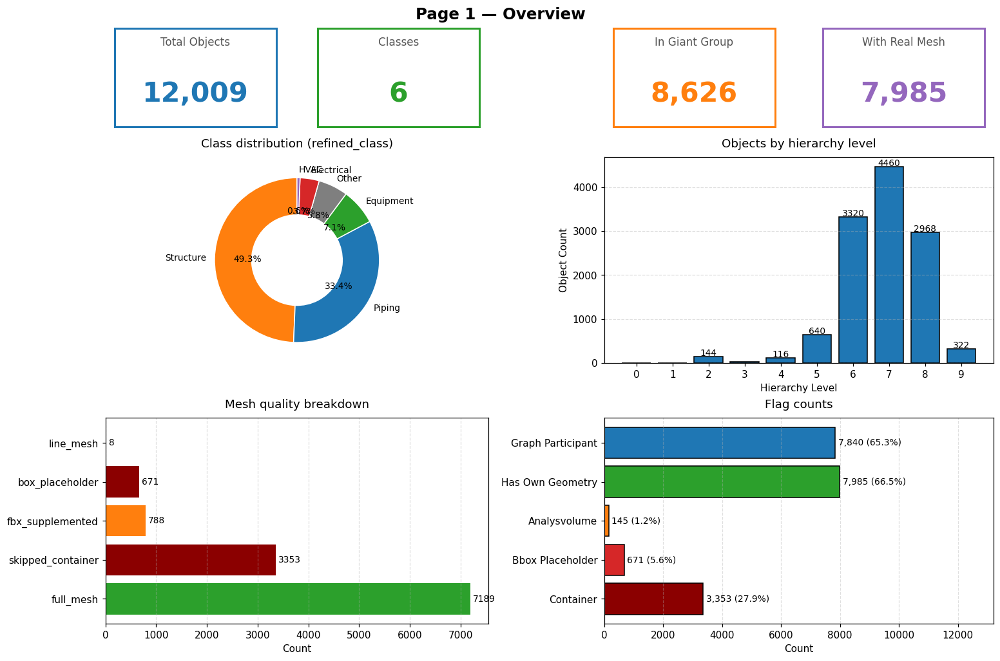
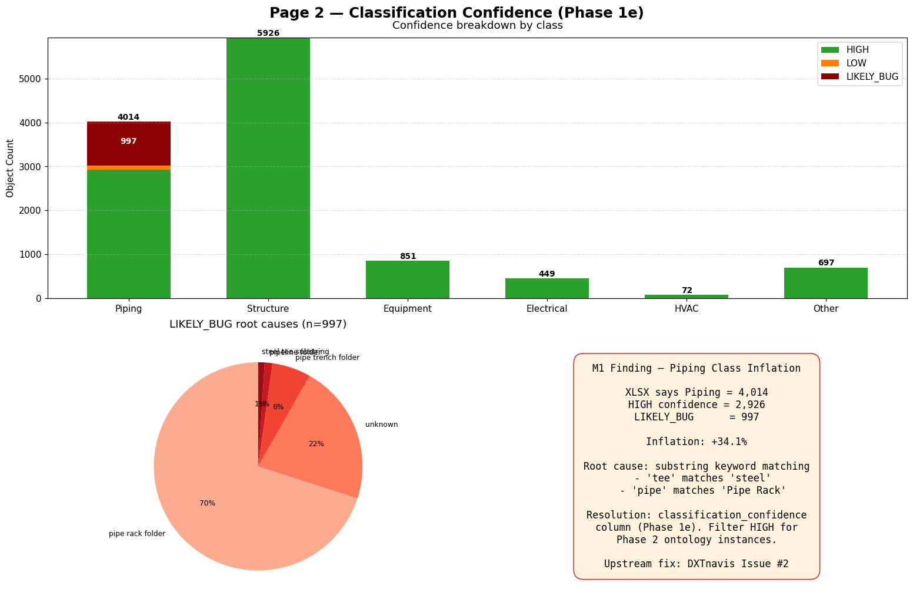
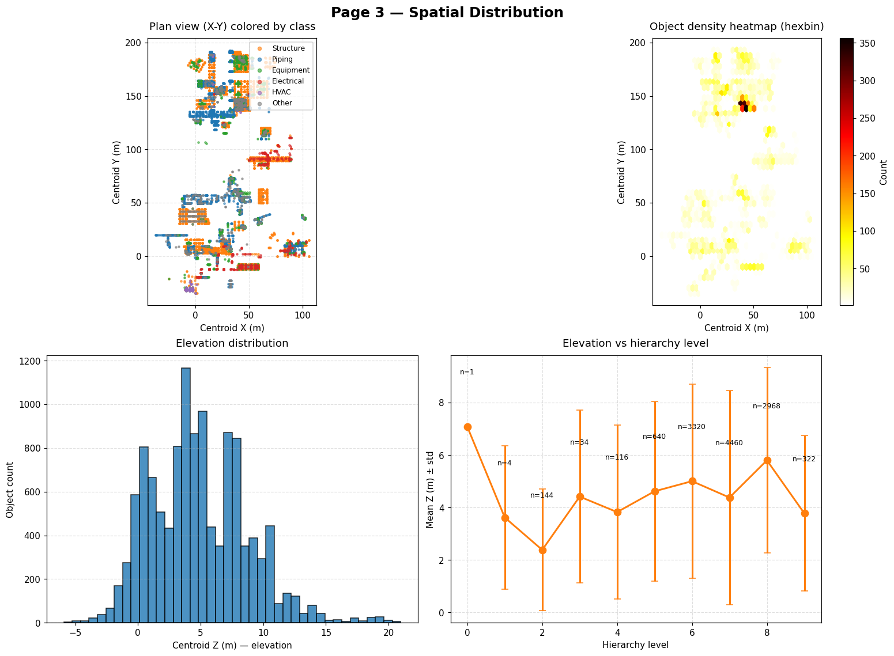
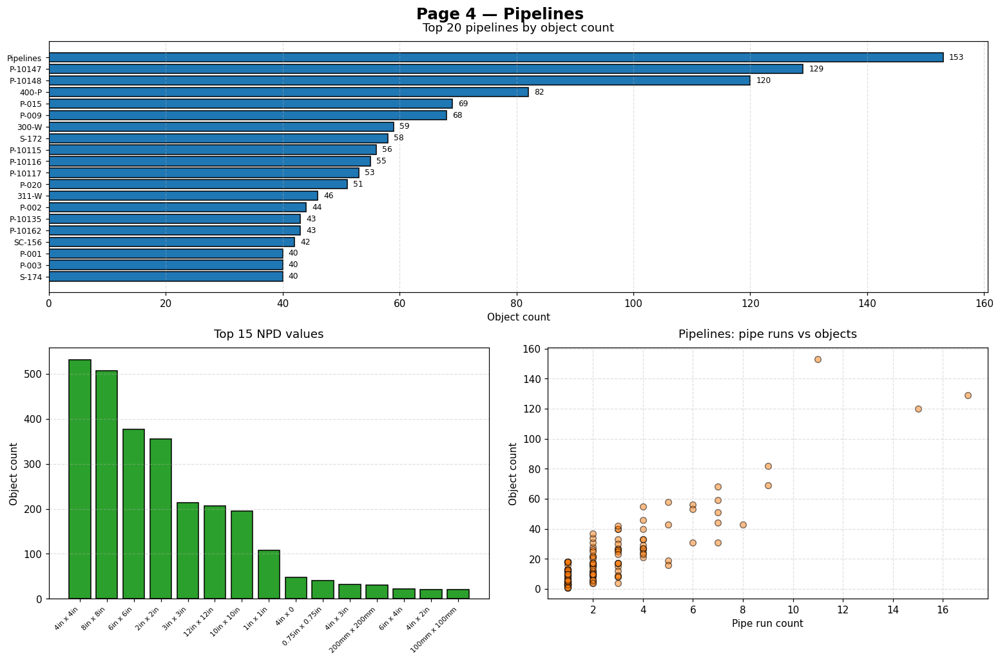
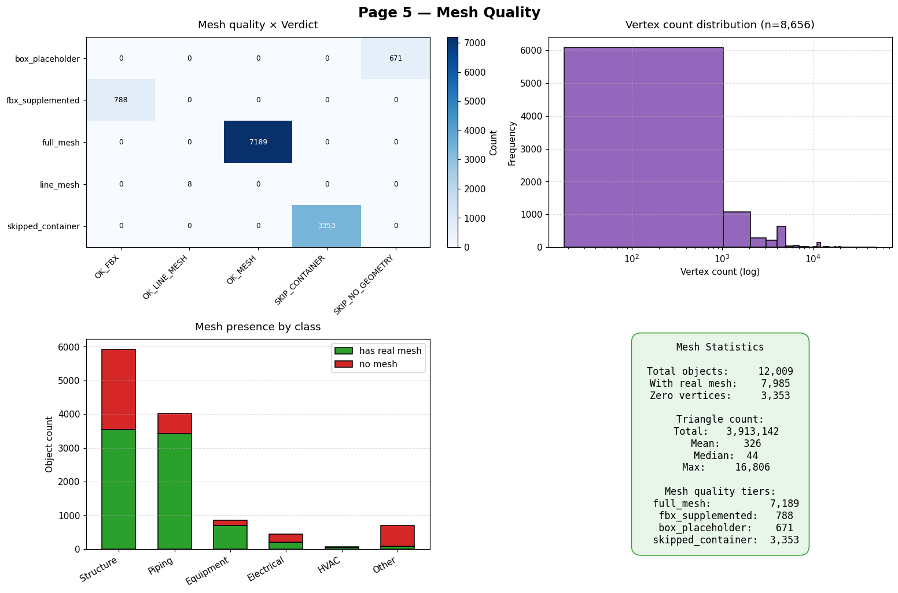
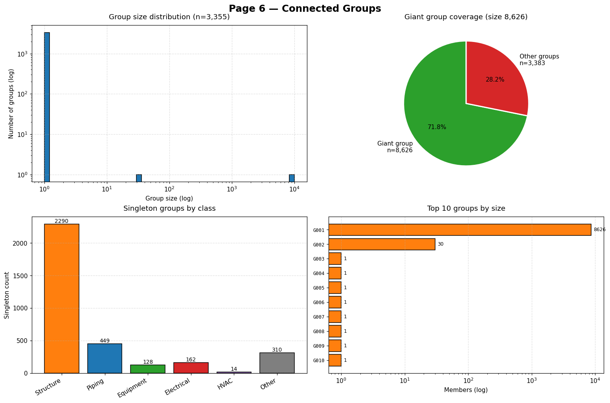
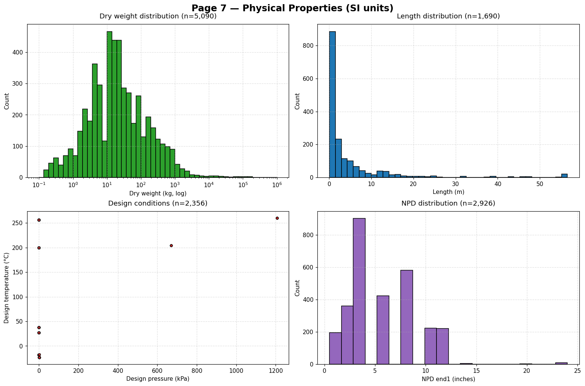

# Power BI Dashboard — Preview & Replication Guide

> **목적**: `data/powerbi/2026-04-07/` 의 현재 CSV 로 Power BI Desktop 에서
> 만들 수 있는 대시보드의 **시각 미리보기** 와 **재현 가이드**.
>
> 작성 시점: 2026-04-12 (Phase 2 planning checkpoint 대기 기간 활동)
>
> 이 폴더의 PNG 들은 `scripts/powerbi_mockup.py` 가 matplotlib 로 생성한
> 목업(mockup)입니다. Power BI Desktop 에서 각 페이지를 만들 때 이 이미지들을
> **"도달해야 할 목표"** 로 사용하세요.

---

## 생성된 미리보기

| # | 페이지 | 이미지 | 답하는 질문 |
|:-:|--------|-------|-----------|
| 1 | Overview | [page1-overview.png](figures/page1-overview.png) | 전체 규모, 분류, 플래그 요약 |
| 2 | Classification Confidence | [page2-classification-confidence.png](figures/page2-classification-confidence.png) | M1 finding 영향 시각화 |
| 3 | Spatial Distribution | [page3-spatial-distribution.png](figures/page3-spatial-distribution.png) | 플랜트 공간 배치 (plan view + elevation) |
| 4 | Pipelines | [page4-pipelines.png](figures/page4-pipelines.png) | 배관 시스템 구성 |
| 5 | Mesh Quality | [page5-mesh-quality.png](figures/page5-mesh-quality.png) | 3D 메시 상태 검증 |
| 6 | Connected Groups | [page6-connected-groups.png](figures/page6-connected-groups.png) | 공간 그래프 구조 |
| 7 | Physical Properties | [page7-physical-properties.png](figures/page7-physical-properties.png) | SI 단위 물리량 (중량/길이/압력/온도/NPD) |

---

## Power BI 에서 이 대시보드를 재현하는 법

### 사전 준비 — Import

1. **Power BI Desktop** 실행 (Microsoft Store 에서 무료 설치)
2. **Home → Get Data → Text/CSV**
3. `data/powerbi/2026-04-07/` 의 10 파일 전부 import:
   - `fact_objects.csv` (12,009 × 67)
   - `fact_adjacency.csv` (110,173 × 11)
   - `fact_adjacency_undirected.csv` (110,173 × 7)
   - `bridge_group_member.csv` (12,009 × 2)
   - `dim_class.csv` (6 × 5)
   - `dim_level.csv` (10 × 2)
   - `dim_pipeline.csv` (147 × 6)
   - `dim_meshq.csv` (4 × 3)
   - `dim_verdict.csv` (4 × 3)
   - `dim_group.csv` (3,355 × 16)
4. 인코딩: UTF-8 (BOM 자동 감지, 한글 문제 없음)

### Relationships 설정

Modeling → Manage Relationships:

```
dim_class[class_name]       ───► fact_objects[refined_class]
dim_level[level]            ───► fact_objects[level]
dim_meshq[mesh_quality]     ───► fact_objects[mesh_quality]
dim_verdict[verdict]        ───► fact_objects[verdict]
dim_pipeline[pipeline_name] ───► fact_objects[sp3d_pipeline]
dim_group[group_id]         ───► fact_objects[group_id]
dim_group[group_id]         ───► bridge_group_member[group_id]
bridge_group_member[object_id] ───► fact_objects[object_id]

fact_adjacency[source_object_id] ───► fact_objects[object_id]  (활성)
fact_adjacency[target_object_id] ───► fact_objects[object_id]  (비활성 — DAX USERELATIONSHIP 사용)
```

---

## Page 1 — Overview



### 구성 요소

| 영역 | 시각화 | 데이터 |
|------|-------|-------|
| KPI Cards (4개) | Card visuals | `COUNTROWS(fact_objects)`, `DISTINCTCOUNT(fact_objects[refined_class])`, `CALCULATE(COUNTROWS(fact_objects), fact_objects[in_giant_group]=TRUE)`, `CALCULATE(COUNTROWS(fact_objects), fact_objects[has_own_geometry]=TRUE)` |
| Class Donut | Donut chart | Values: `fact_objects[object_id]` (Count), Legend: `refined_class` |
| Level Histogram | Clustered column | Axis: `fact_objects[level]`, Value: Count of `object_id` |
| Mesh Quality Bar | Stacked horizontal bar | Axis: `fact_objects[mesh_quality]`, Value: Count |
| Flags Bar | Clustered horizontal bar | Axis: measure per flag, Value: TRUE count |

### DAX 측정값 예시

```dax
Total Objects = COUNTROWS(fact_objects)
In Giant Group = CALCULATE(COUNTROWS(fact_objects), fact_objects[in_giant_group] = TRUE())
Container Count = CALCULATE(COUNTROWS(fact_objects), fact_objects[is_container] = TRUE())
Analysis Volume Count = CALCULATE(COUNTROWS(fact_objects), fact_objects[is_analysis_volume] = TRUE())
```

### Color coding

이 프로젝트에서 사용한 class 색상 (일관성을 위해 DAX 에 고정):

```
Structure   : #ff7f0e (주황)
Piping      : #1f77b4 (파랑)
Equipment   : #2ca02c (녹색)
Electrical  : #d62728 (빨강)
HVAC        : #9467bd (보라)
Other       : #7f7f7f (회색)
```

---

## Page 2 — Classification Confidence ⭐ M1 Finding 시각화



### 구성 요소

| 영역 | 시각화 | 데이터 |
|------|-------|-------|
| Stacked Bar (Top) | 100% stacked column | Axis: `refined_class`, Legend: `classification_confidence`, Value: Count |
| Bug Reasons Pie | Donut chart | Filter `classification_confidence = "LIKELY_BUG"`, Legend: `classification_confidence_reason` |
| M1 Summary Text Box | Text box | M1 finding 결과 요약 (정적 텍스트) |

### 필터 설정

이 페이지는 **M1 Finding 전용**. 슬라이서로:
- `refined_class` (선택)
- `classification_confidence` (HIGH / LOW / LIKELY_BUG)

### 통찰 가능한 질문

- "Piping 4,014 중 진짜 pipe 는 몇 개? (HIGH 2,926)"
- "LIKELY_BUG 중 가장 큰 원인은? (Pipe Rack folder 698)"
- "Structure 에 cross-contamination 이 있나? (0 건)"

### Decision support

```dax
Trustworthy Piping Count =
CALCULATE(
    COUNTROWS(fact_objects),
    fact_objects[refined_class] = "Piping",
    fact_objects[classification_confidence] = "HIGH"
)

Piping Inflation % =
DIVIDE(
    CALCULATE(COUNTROWS(fact_objects), fact_objects[classification_confidence] = "LIKELY_BUG"),
    [Trustworthy Piping Count]
) * 100
```

---

## Page 3 — Spatial Distribution



### 구성 요소

| 영역 | 시각화 | 데이터 |
|------|-------|-------|
| 2D Scatter (XY) | Scatter chart | X: `centroid_x`, Y: `centroid_y`, Legend: `refined_class`, Size: 고정 |
| Density Heatmap | Matrix + conditional formatting | X bins: `FLOOR(centroid_x, 10)`, Y bins: `FLOOR(centroid_y, 10)` |
| Z Elevation Histogram | Clustered column | Axis: `FLOOR(centroid_z, 1)`, Value: Count |
| Level vs Elevation | Line + clustered column | X: `level`, Line: AVG `centroid_z`, Error bars: STDEV |

### 주의 사항

**Power BI 의 Scatter chart 는 2,000 개 포인트 제한** (기본값). 12,009 객체 표시를 위해:
- **High Density Sampling** 옵션 켜기 (Format → General), 또는
- **R/Python visual** 로 scatter (matplotlib 기반) 작성

### 슬라이서

- `refined_class` (checkbox)
- `level` (range)
- `is_container` (toggle)

### 질문

- "이 플랜트의 공간 footprint 는? (145m × 229m)"
- "어느 영역이 가장 밀집되어 있는가?"
- "Level 7-8 이 주로 존재하는 Z 는?"

---

## Page 4 — Pipelines



### 구성 요소

| 영역 | 시각화 | 데이터 |
|------|-------|-------|
| Top 20 Pipelines Bar | Horizontal bar (sorted desc) | Axis: `dim_pipeline[pipeline_name]` Top N filter, Value: `object_count` |
| NPD Distribution | Clustered column | Axis: `fact_objects[sp3d_npd]`, Value: Count (Top 15) |
| PipeRun vs Objects Scatter | Scatter chart | X: `pipe_run_count`, Y: `object_count`, tooltip: `pipeline_name` |

### 슬라이서

- `classification_confidence = "HIGH"` 필터 ← **M1 finding 적용**

### 질문

- "가장 큰 파이프라인은? (P-10147 = 129 objects)"
- "147 개 파이프라인이 정상인가? (dim_pipeline 에 'Pipelines' fake entry 1개 있음 — §6.1 known anomaly)"
- "NPD 분포가 표준적인가?"

### 알려진 이슈

- `sp3d_pipeline = "Pipelines"` 153건 (폴더명이 속성값으로 들어온 것)
- dim_pipeline 에는 이 "Pipelines" 가 1행으로 포함됨 (146 real + 1 fake)
- 슬라이서 `pipeline_name != "Pipelines"` 로 제거 가능

---

## Page 5 — Mesh Quality



### 구성 요소

| 영역 | 시각화 | 데이터 |
|------|-------|-------|
| Mesh × Verdict Matrix | Matrix with heatmap | Row: `mesh_quality`, Column: `verdict`, Value: Count |
| Vertex Count Log Hist | Column (log scale) | Axis: `LOG(vertex_count)` bins, Value: Count |
| Mesh by Class Stack | 100% stacked column | Axis: `refined_class`, Legend: `has_real_mesh` |
| Stats Text Box | Card | 총계 / 평균 / 중앙값 |

### DAX

```dax
Full Mesh Coverage =
DIVIDE(
    CALCULATE(COUNTROWS(fact_objects), fact_objects[mesh_quality] = "full_mesh"),
    COUNTROWS(fact_objects)
) * 100

Avg Triangles =
AVERAGE(fact_objects[triangle_count])
```

---

## Page 6 — Connected Groups



### 구성 요소

| 영역 | 시각화 | 데이터 |
|------|-------|-------|
| Group Size Log-Log Hist | Column (both log) | Axis: `LOG(group_size)`, Value: Count of groups |
| Giant vs Others Pie | Donut | Split: `in_giant_group` TRUE/FALSE |
| Singletons by Class | Clustered column | Filter `group_size=1`, Axis: `refined_class` |
| Top 10 Groups Bar | Horizontal bar | TopN `group_size`, Axis: `group_id` |

### 질문

- "Giant group 이 어느 정도 지배적인가? (71.8% = 8,626 / 12,009)"
- "Singleton 3,353 의 클래스 구성? (대부분 Other 또는 Container)"
- "Giant 외 다른 큰 그룹이 있는가? (30-element subsystem 1 개)"

---

## Page 7 — Physical Properties



### 구성 요소

| 영역 | 시각화 | 데이터 |
|------|-------|-------|
| Dry Weight Hist (log) | Column (log) | `dry_weight_kg > 0` only |
| Length Hist | Column | `length_m > 0` |
| Pressure × Temp Scatter | Scatter | `design_pressure_kpa` × `design_temperature_c` |
| NPD Distribution | Column | `npd_end1_m * 39.37` (m → inches conversion for display) |

### 주의

- SI 단위 컬럼은 Phase 1b 파서 결과이므로 **null 이 많음** (sparse)
- 대부분의 필터링은 `NOT ISBLANK(...)` 로 처리
- Max dry weight 147 tons, max length 56.5 m 등 이상치 확인

---

## 대시보드 활용 시나리오

### 시나리오 1 — "이 플랜트 모델은 어떤 모양인가?"

페이지 1 (Overview) → 페이지 3 (Spatial) → 페이지 6 (Groups)

**답변 경로**: 12,009 객체 → 클래스별 분포 확인 → 공간 배치 확인 (XY scatter) → 연결성 구조 확인 (giant group 71.8%)

### 시나리오 2 — "데이터 품질은 어떠한가?"

페이지 1 (flags) → 페이지 5 (mesh quality) → 페이지 2 (classification confidence)

**답변 경로**: 플래그로 known 이슈 확인 → mesh 상태 검증 → M1 finding 의 영향 확인

### 시나리오 3 — "배관 시스템을 이해하고 싶다"

페이지 4 (Pipelines) → 페이지 2 (confidence, HIGH filter) → 페이지 7 (NPD/pressure)

**답변 경로**: Top pipelines → 신뢰 가능한 HIGH 만 필터 → NPD 및 설계 조건

### 시나리오 4 — "Phase 2 전에 데이터 확인"

페이지 2 (M1 impact) 를 Core 로 사용, 다른 페이지는 보조

**답변 경로**: DXTnavis PR 이후 데이터 재검토 시 이 페이지의 LIKELY_BUG 카운트가 줄어드는 것을 기대. 재생성 후 비교 baseline 으로 활용.

---

## Power BI 에서 할 수 없거나 어려운 것

| 원하는 시각화 | Power BI 에서의 제약 | 대안 |
|-------------|------------------|------|
| 3D scatter (centroid x/y/z) | Power BI 에 3D 산점도 없음 | Power BI 의 Scatter chart 에서 size=Z 로 의사 3D 또는 Python visual |
| 대규모 graph (110K edges) 시각화 | Force-directed graph visual 은 1K 노드 정도가 한계 | 별도 도구 (Gephi, Cytoscape) |
| 대용량 2D scatter (12K points) | 기본 2K 샘플 제한 | High Density Sampling 옵션 또는 R/Python visual |
| SPARQL 쿼리 | Power BI 는 RDF 지원 없음 | 별도 도구 (Protégé, rdflib) |
| OWL 추론 | 지원 없음 | Phase 3 pyshacl/owlrl |

Phase 4 (NetworkX 분석), Phase 5 (LLM), Phase 2 (OWL 온톨로지) 는 Power BI 의 한계를 넘어서는 작업들이며 각 도구에서 별도 구현됩니다.

---

## 재생성 방법

목업 PNG 를 데이터 변화 후 다시 만들려면:

```bash
.venv/bin/python scripts/powerbi_mockup.py
```

특히 DXTnavis PR merge 후 Phase 1a/1d 재실행 이후에 이 스크립트를 다시 돌리면, **before/after 비교** 가 가능합니다. 특히 Page 2 (confidence) 가 가장 극적으로 변할 것입니다 — 모든 Piping 이 HIGH 로 가는 것이 이상적 목표.

---

## 관련 문서

- `docs/analysis/phase-1-verification-guide.md` — 수동 검증 체크리스트 + Power BI §4 import 가이드
- `docs/findings/2026-04-12-M1-piping-misclassification/` — M1 finding 상세 + 증거
- `data/powerbi/2026-04-07/README.md` — CSV 파일 명세 (자동 생성)
- `scripts/powerbi_mockup.py` — 이 PNG 들을 생성하는 Python 스크립트
