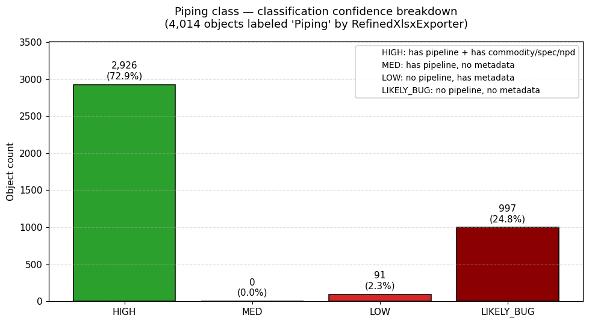
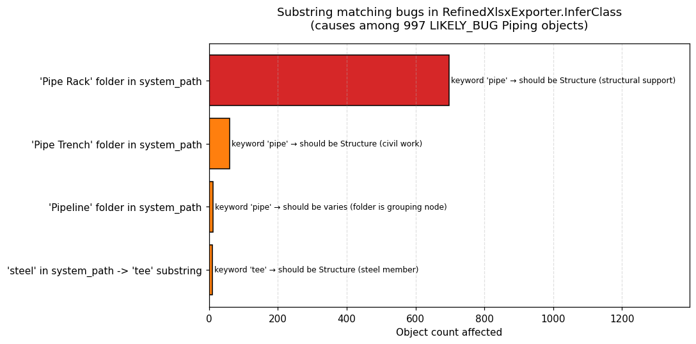
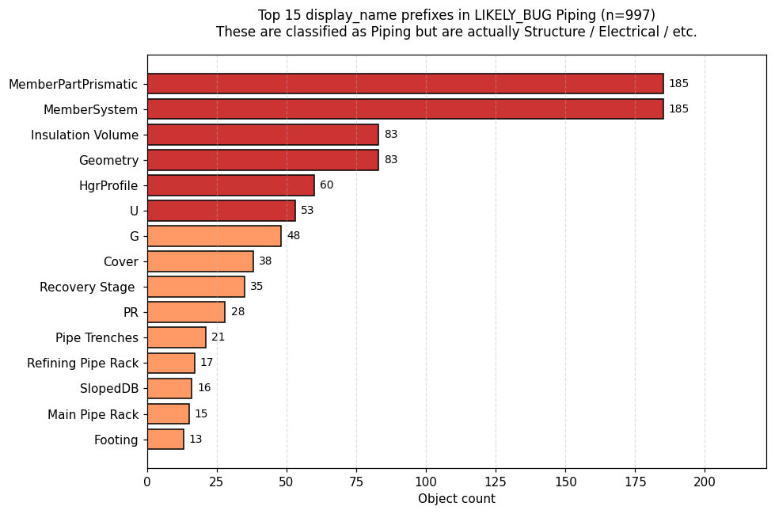
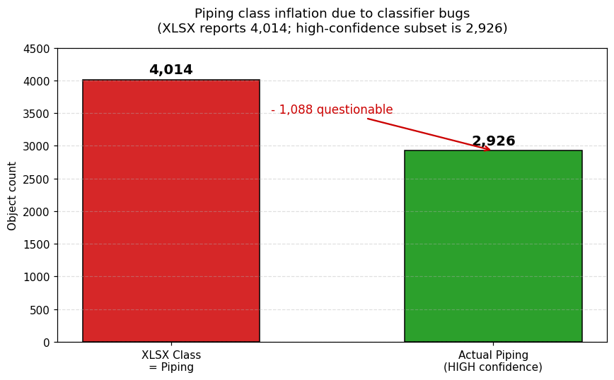

# 2026-04-12 — M1 — Piping misclassification via XLSX substring matching

**Severity**: 🟠 MAJOR
**Status**: ✅ Resolved locally (DXTnavis source fix tracked via [Issue #2](https://github.com/tygwan/DXTnavis/issues/2))
**Discovered by**: Phase 1 verification audit (semantic deep dive)
**Affects**: All Phase 1 downstream outputs containing `refined_class='Piping'`

---

## 1. Finding

DXTnavis 의 `RefinedXlsxExporter.InferClass` 가 **word boundary 없는 substring 매칭** 을 사용하여,
구조/전기 객체를 Piping 으로 오분류합니다.

**정량 영향**:
- 전체 XLSX Piping: **4,014 개**
- HIGH confidence (pipeline + commodity/spec/npd 메타): **2,926 개** ✅
- LIKELY_BUG (pipeline 도 metadata 도 없음): **997 개** 🔴
- Piping 클래스가 약 **+34% 부풀려짐** (2,926 → 4,014)

**구체 증거**:
- `MemberSystem-1-0151` — system path: `"Electrical Device > Steel > MemberSystem"`.
  Piping 키워드 `tee` 가 "s-**TEE**-l" 부분 문자열로 매치 → Piping 분류.
  실제로는 Structure/Electrical.
- `Cable Tray Part` × 25, `Cableway Feature` × 15 — sys_path 에 "Pipe Rack" 포함 → Piping.
  실제로는 Electrical.
- `Pipe Trenches` × 21 — 콘크리트 trench 구조물 → Structure 이어야 함. `pipe` 키워드 매치 → Piping.

## 2. Evidence

### 2.1 Reproducible audit

```bash
.venv/bin/python docs/findings/2026-04-12-M1-piping-misclassification/audit.py
```

이 스크립트는 아래 CSV 4개를 `data/` 에 생성합니다.

### 2.2 Data artifacts

| 파일 | 내용 |
|------|------|
| `data/piping_confidence_breakdown.csv` | 4 rows — Piping 4,014 을 HIGH/MED/LOW/LIKELY_BUG 로 분해 |
| `data/substring_bug_causes.csv` | 4 rows — 키워드별 false positive 원인과 건수 |
| `data/likely_misclassified_sample.csv` | Top 20 display_name prefix 중 LIKELY_BUG 소속 |
| `data/keyword_hit_debug.csv` | 8 rows — 각 Piping 키워드가 어떤 substring 에 매치되는지 |
| `data/structure_sanity_check.csv` | Structure 클래스에 cross-contamination 없음 증명 (sp3d_pipeline = 0, sp3d_eqp_type_0 = 0) |

### 2.3 Visualizations

**Figure 1 — Piping confidence breakdown**



2,926 HIGH (신뢰 가능) vs 997 LIKELY_BUG (오분류 의심).

**Figure 2 — Substring bug causes**



- `Pipe Rack` 폴더명 → 698 건 (`pipe` 키워드 매치)
- `Pipe Trench` 폴더명 → 60 건
- `Pipeline` 폴더명 → 12 건
- `steel` substring → `tee` 매치 → 10 건

**Figure 3 — Top 15 display_name prefixes in LIKELY_BUG**



`MemberSystem` (185), `MemberPartPrismatic` (185), `Geometry` (83),
`Insulation Volume` (83), `HgrProfile` (60), `Cover` (38),
`Pipe Trenches` (21), `Refining Pipe Rack` (17) 등.

**Figure 4 — Class distribution inflation**



XLSX 4,014 vs 실제 Piping 2,926. 차이 1,088 건이 questionable.

## 3. Analysis

### 3.1 Root cause

`DXTnavis/Services/RefinedXlsxExporter.cs` 의 `InferClass` 메서드 (line 298-375):

```csharp
string combined = (sysPath + " " + displayName).ToLowerInvariant();
foreach (var key in objData.Keys)
{
    if (key.StartsWith("__")) continue;
    combined += " " + key.ToLowerInvariant();
}

if (combined.Contains("pipe") || combined.Contains("valve") ||
    combined.Contains("flange") || combined.Contains("elbow") ||
    combined.Contains("tee") || ...)
    return "Piping";
```

문제:
1. **`.Contains()` 는 substring 매칭** — word boundary 고려 없음
2. `"tee"` 키워드가 `"steel"` 부분 문자열로 매치됨 (s-**tee**-l)
3. `"pipe"` 키워드가 폴더명 `"Pipe Rack"`, `"Pipe Trench"`, `"Pipeline"` 에 매치됨
4. Piping 이 Tier 3 에서 첫 번째로 평가되므로 이런 false positive 가 Structure 나 Electrical 분류보다 우선함
5. **속성 키 이름** 까지 검색 대상에 포함되어 의도치 않은 매치 빈발

### 3.2 Impact

| Downstream phase | 영향 |
|-----------------|------|
| **Phase 1a Gold** | `bim_objects_enriched.parquet` 의 `refined_class = 'Piping'` 4,014 중 997 개가 잘못됨 |
| **Phase 1d PowerBI** | `fact_objects.csv` 의 class 분포 부정확; `dim_class.csv` Piping 카운트 4,014 로 과대계상 |
| **Phase 1d Foundry** | `ontology/2026-04-07/object_types/piping.parquet` 4,014 행 중 997 행 misclassified |
| **Phase 2 Ontology** | `PipingComponent` Object Type 정의 시 997 개가 포함되어 type mismatch 유발 |
| **Phase 4 Analytics** | 파이프 구조 그래프 분석 결과 왜곡 (실제 pipe 아닌 객체가 포함) |
| **Phase 5 LLM** | "파이프 몇 개?" 질의에 4,014 답변 → 사용자가 1,088 개 중 어떤 것이 진짜인지 분별 불가 |

### 3.3 Related known issues

- `docs/analysis/refined-xlsx-exporter-logic.md` §4.3 — "Substring 기반, word-boundary 없음" 을 로직 분석 시 이미 인지했음. 당시에는 영향 범위를 정량화하지 않음.
- `docs/analysis/phase-1-verification-findings.md` A1 — "Pipelines 라벨 153 건" 은 이 버그의 하위 증상.
- XLSX oracle 테스트 100% 통과 → Python 포팅은 올바름. 버그는 원천 C# 에 있음.

## 4. Resolution

### 4.1 Options considered

| Option | 접근 | 장점 | 단점 | 시간 |
|--------|------|------|------|------|
| **1. Accept** | 현재 상태 수용, Phase 2 에서 필터 | 현 코드 불변 | 기술 부채 Phase 2 로 이월 | 0일 |
| **2. Phase 1e confidence column** | `classification_confidence` 컬럼 추가 | 명시적, 테스트 가능, Phase 2 에서 필터링 자유 | Phase 1d 재실행 필요 | 0.5일 |
| **3. Python classifier override** | Python 포팅을 수정 | 정확한 분류 | Oracle contract 깨짐, C# 와 동기 깨짐 | 1일 |
| **4. DXTnavis 원천 수정 + 재생성** | C# InferClass 수정 후 XLSX 재 export | 원천 해결, 모든 프로젝트 혜택 | C# 수정 + 재export 필요 | 1-2일 |

### 4.2 Selected approach

**Option 2 (Phase 1e confidence column) + Option 4 (DXTnavis PR)** 병행.

**근거**:
1. Option 2 는 현재 repository 에서 즉시 적용 가능하고 Phase 2 를 언블록함
2. Option 4 는 장기적으로 올바른 해결이지만 C# 작업 + 사용자 재 export 필요
3. 두 개가 병행되면 단기 (confidence) 와 장기 (원천) 모두 커버

### 4.3 Action items

- [x] Phase 1e: `src/bimkg/ingest/clean.py` 에 `classification_confidence` 파생 컬럼 추가
- [x] Phase 1e: 테스트 작성 — HIGH 2,926 / LOW 91 / LIKELY_BUG 997 카운트 검증 (18 신규 테스트)
- [x] Phase 1e: Gold 테이블 + Phase 1d 산출물 재생성 (216 → 218 cols)
- [x] Phase 1e: `phase-1e-confidence-layer.md` task log 작성
- [x] DXTnavis Issue: [Issue #2](https://github.com/tygwan/DXTnavis/issues/2) 생성 완료
- [ ] Phase 2: `PipingComponent` Object Type 구축 시 `classification_confidence = 'HIGH'` 만 포함 (Phase 2 시작 시 적용)

### 4.4 Resolution commit

**Local resolution**: Phase 1e 에서 `classification_confidence` + `classification_confidence_reason` 2개 컬럼을 Gold 테이블, PowerBI fact_objects, 모든 Foundry Object Type parquet 에 추가.

- 커밋: (Phase 1e 커밋 해시 참조)
- 검증: 210/210 tests passing (18 Phase 1e 신규 포함)
- 결과: Piping 4,014 분해 — HIGH 2,926 / LOW 91 / LIKELY_BUG 997
- 원인별 LIKELY_BUG 분포 재현:
  - `piping_no_metadata_pipe_rack_folder`: 698
  - `piping_no_metadata_pipe_trench_folder`: 60
  - `piping_no_metadata_pipeline_folder`: 12
  - `piping_no_metadata_steel_tee_substring`: 10
  - `piping_no_metadata_unknown`: 217

**Source fix (external)**: [DXTnavis Issue #2](https://github.com/tygwan/DXTnavis/issues/2) 에서 C# `InferClass` 의 regex word boundary 적용 기다림.

**Deprecation path**: DXTnavis 원천 수정 + XLSX 재생성 완료되면 Phase 1e 의 confidence column 은 deprecation 가능 (모든 Piping 이 HIGH 가 되므로).

## 5. References

- **Source code analysis**: [`docs/analysis/refined-xlsx-exporter-logic.md`](../../analysis/refined-xlsx-exporter-logic.md)
- **Original C# source**: https://github.com/tygwan/DXTnavis/blob/main/Services/RefinedXlsxExporter.cs#L298-L375
- **Python port**: [`src/bimkg/ingest/xlsx_classifier.py`](../../../src/bimkg/ingest/xlsx_classifier.py)
- **Oracle test**: [`tests/test_ingest/test_xlsx_classifier.py::test_oracle_100_percent_agreement`](../../../tests/test_ingest/test_xlsx_classifier.py)
- **DXTnavis PR draft**: [`dxtnavis-pr-draft.md`](dxtnavis-pr-draft.md)
- **Gold data**: `data/enriched/2026-04-07/bim_objects_enriched.parquet`
