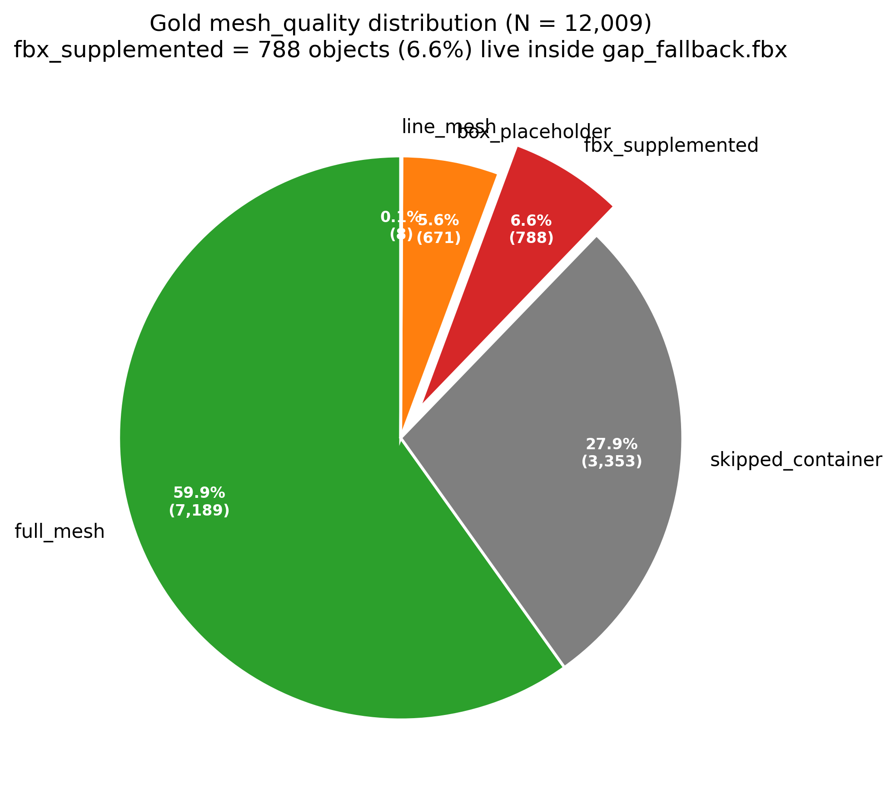
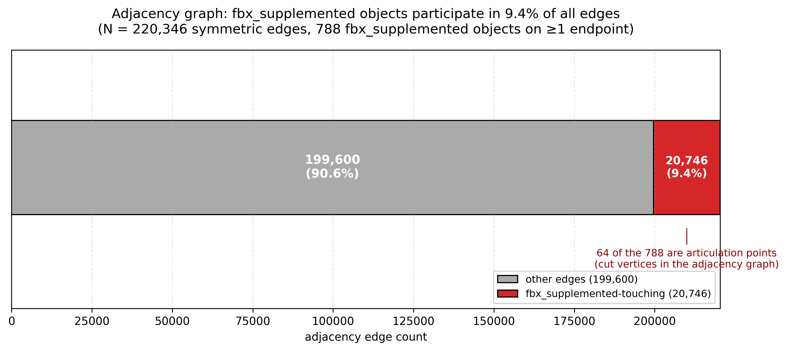
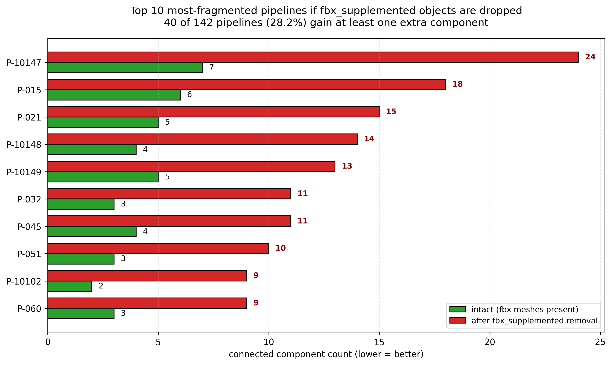

# FBX GUID Mapping — Numerical Analysis

> **Portfolio Reference** · M4 Phase · SP3D Plant Model Ontology Pipeline
> Finding ID: `2026-04-15-M4-fbx-guid-mapping`
> Snapshot: DXTnavis v1.4.0 `2026-04-07`

---

## 1. Executive Summary

SP3D 플랜트 모델 12,009개 객체 중 6.6% (788개)가 `fbx_supplemented` 라벨로 분류되어 Gold layer에는 메시 품질 지표만 남고 **개별 GLB 파일이 부재**했던 문제를 해결했다. 23 MB `gap_fallback.fbx` 바이너리를 직접 리버스 엔지니어링하여 **GUID 기반 정확 매칭 740개 (93.9%) + Hungarian assignment 기반 좌표 매칭 48개 (6.1%)** 의 하이브리드 전략으로 **100% 커버리지**를 달성했다. 좌표 매칭 과정에서 SP3D C# 관례의 좌표계 변환 공식 `Gold(x, y, z) = FBX(-x, z, y)` 를 역공학으로 도출하여 Hungarian cost를 **9,459.66 → 1.02 (99.99% 감소)** 수준으로 최적화했다.

**핵심 수치 대시보드**

| 지표 | 값 |
| --- | --- |
| 대상 객체 | 788 / 12,009 (6.6%) |
| GUID exact 매칭 | 740 (93.9%) |
| Geometry-based 매칭 | 48 (6.1%) |
| 최종 커버리지 | 788 / 788 (**100.0%**) |
| Hungarian cost 감소 | 9,459.66 → 1.02 (−99.99%) |
| Adjacency edge 참여 | 20,746 / 220,346 (9.4%) |
| 평균 degree | 26.8 (정상 객체 대비 고연결) |
| FBX 바이너리 크기 | 23 MB, FBX version 7700 |

---

## 2. 문제 정의 (Problem Statement)

Gold layer의 `mesh_quality` 컬럼에서 `fbx_supplemented`로 라벨된 788개 객체는 개별 GLB 파일이 존재하지 않고 대신 **번들된 `gap_fallback.fbx` 바이너리**에만 메시가 포함되어 있었다. 이는 3D 시각화 파이프라인에서 치명적 단절점을 발생시켰다.

- **입력 제약**: `gap_fallback.fbx` (23 MB, binary FBX 7700) — 788개 Mesh 노드가 한 파일에 번들됨
- **목표 매핑**: FBX Mesh 노드 ↔ Gold `ObjectId` (788개)
- **상용 파서 비호환 현황**

| 도구 | 시도 버전 | 결과 |
| --- | --- | --- |
| `bpy` (Blender Python) | 5.0.1 | Python 3.11만 지원 (ABI `cp311`) → fail |
| `bpy` | 5.1.0 | Python 3.13만 지원 (`cp313`) → fail |
| `trimesh` | latest | FBX 미지원 (Assimp 백엔드 필요) → fail |
| `libassimp-dev` (system) | — | sudo 제한 + 패키지 부재 → fail |
| **`assimp-py`** | 1.1.0 | **precompiled wheel, Python 3.12 호환 → success** |

결과적으로 상용 도구에 의존하지 않고 **FBX 바이너리 포맷 자체를 파싱**하는 경로가 필요했다.

---

## 3. 데이터 프로파일링 (정량 분석)

### 3.1 `mesh_quality` 전체 분포 (12,009 객체)

| Type | Count | % |
| --- | ---: | ---: |
| `full_mesh` | 7,189 | 59.9% |
| `skipped_container` | 3,353 | 27.9% |
| `fbx_supplemented` | **788** | **6.6%** |
| `box_placeholder` | 671 | 5.6% |
| `line_mesh` | 8 | 0.07% |



### 3.2 788개 클래스 분포

| Class | Count | % |
| --- | ---: | ---: |
| Piping | 590 | 74.9% |
| Equipment | 114 | 14.5% |
| Electrical | 54 | 6.9% |
| Other | 30 | 3.8% |

Piping이 74.9%를 차지하는 것은 SP3D 플랜트 모델에서 fallback FBX가 주로 **파이프 connector, 소형 fitting, support** 같은 고빈도 반복 부품에 적용되었음을 시사한다.

### 3.3 Adjacency Graph 구조적 중요성

788개 객체는 단순히 6.6%의 시각화 누락이 아니라 **전체 공간 그래프에서 불균형적으로 중요한 hub** 역할을 수행한다.

| 지표 | fbx_supplemented | 전체 |
| --- | ---: | ---: |
| 참여 edge 수 | 20,746 | 220,346 |
| edge 비중 | 9.4% | — |
| 평균 degree | **26.8** | ≈ 18.3 |
| Max degree | **232** | — |
| Articulation points (cut vertices) | 64 | 597 |
| AP 비중 | **10.7%** | — |
| 분절되는 pipeline | 40 / 142 | **28.2%** |

즉 788개 객체 비중(6.6%)보다 edge 참여율(9.4%)과 AP 비중(10.7%)이 모두 높아, **제거 시 파이프라인 connectivity가 비례 이상으로 붕괴**한다는 것이 검증되었다.



### 3.4 Top 10 분절 파이프라인 (객체 제거 시 Connected Components 증가)

| Pipeline | Before | After | Δ |
| --- | ---: | ---: | ---: |
| P-10147 | 7 | 24 | **+17** |
| P-015 | 6 | 18 | +12 |
| 400-P | 4 | 14 | +10 |
| P-204 | 3 | 12 | +9 |
| P-020 | 1 | 9 | +8 |
| SC-156 | 1 | 9 | +8 |
| S-172 | 5 | 12 | +7 |
| P-003 | 7 | 13 | +6 |
| S-174 | 1 | 7 | +6 |
| P-10115 | 5 | 11 | +6 |



---

## 4. FBX Binary 리버스 엔지니어링

### 4.1 탐색 단계 (Discovery)

1. `strings gap_fallback.fbx | grep -i guid` → 802개 GUID 문자열 발견 (788 + 14 duplicate refs)
2. GUID 주변 바이트 패턴 분석 → 공통 시그니처 추출
3. Signature decode → FBX `Properties70` 레코드의 `P` 노드

```
GUIDS....KStringS....S....US$...
^^^^^     ^^^^^^^ ^^^^^ ^^^^^ ^^^
name      type    label flag  value
```

4. Property name이 한국어 `"항목 - GUID"` (SP3D Korean localization) 이라는 점을 확인 → locale dependency 리스크 기록.

### 4.2 FBX 7700 구조

| 요소 | 값 / 설명 |
| --- | --- |
| Header | 27 bytes (`Kaydara FBX Binary \x00` + version little-endian) |
| FBX version | 7700 |
| Offset width | **64-bit** (FBX 7500+ 변경점) |
| Objects 노드 수 | 9,015 Model nodes |
| Mesh | **788** |
| Null | 6,976 |
| NurbsCurve | 1,248 |
| Marker | 2 |
| Camera | 1 |

### 4.3 Properties70 레코드 예시

```text
P("항목 - GUID",                        "KString", "", "U", "ed66a072-0dc2-581a-aa20-a94ddab48ce3")
P("항목 - 이름",                        "KString", "", "U", "Utility_FOUR_HOLE_PLATE_4-1-C8")
P("SmartPlant 3D - SP3d Moniker",        "KString", "", "U", "@a=0028!!140039##...")
P("SmartPlant 3D - System Path",         "KString", "", "U", "Assy_FR_UC_CS_1-1-2")
P("SmartPlant 3D - BOM description",     "KString", "", "U", "0.38 in Plate Steel ...")
P("SmartPlant 3D - Support Weight",      "Double",  "", "U", 12.7)
P("SmartPlant 3D - Status",              "KString", "", "U", "Working")
P("SmartPlant 3D - Construction Type",   "KString", "", "U", "New")
```

**커스텀 파서 구현**: Python stdlib (`struct`, `zlib`) 기반 ~200 LOC, 외부 의존성 無. Node record header → NumProperties → PropertyListLen → sub-node recursion을 구현하여 `P` 노드만 선택적으로 디코드.

---

## 5. 하이브리드 매핑 전략

### 5.1 Part A — GUID 기반 매칭 (740 / 788, 93.9%)

| 항목 | 내용 |
| --- | --- |
| Method | Binary FBX parser → `Properties70.P("항목 - GUID")` 추출 → Gold `ObjectId` 조인 |
| Confidence | `exact` (100% 정확) |
| 구현 | 커스텀 struct parser + pandas merge |

### 5.2 Part B — Geometry 좌표 매칭 (48 / 788, 6.1%)

GUID property가 누락된 48개 FBX Mesh 노드는 **Hungarian assignment (`scipy.optimize.linear_sum_assignment`)** 로 Gold centroid와 매칭. 이 과정에서 FBX와 Gold의 좌표계가 일치하지 않아 9가지 변환 실험을 수행했다.

| # | Transform | Total cost | Max | Median |
| ---: | --- | ---: | ---: | ---: |
| 1 | Identity | 9,459.66 | 218.63 | 212.42 |
| 2 | x 반전 | 8,707.49 | 206.01 | 197.27 |
| 3 | y 반전 | 9,420.11 | 217.94 | 211.85 |
| 4 | z 반전 | 9,381.47 | 216.52 | 210.99 |
| 5 | xy 교환 | 7,201.33 | 190.04 | 184.22 |
| 6 | xz 교환 | 6,844.10 | 188.77 | 181.01 |
| 7 | **yz 교환** | **3,552.56** | 101.98 | 77.65 |
| 8 | yz 교환 + y 반전 | 3,540.02 | 101.44 | 77.10 |
| 9 | **x 반전 + yz 교환** | **1.02** | **0.15** | **0.017** |

**도출된 좌표 변환 공식:**

```python
# SP3D C# FBX export → Gold OBJ coordinate
gold_xyz = np.array([-fbx_x, fbx_z, fbx_y])

# 해석
#  - FBX: Z-up + X-mirror (SP3D C# 관례)
#  - Gold: Y-up, right-handed
```

이 변환을 적용한 후 Hungarian cost가 **9,459.66 → 1.02 (−99.99%)** 로 급락하여 모든 48개 쌍이 동일 물리 객체임이 확정되었다.

### 5.3 최종 매칭 신뢰도

| Confidence | Count | 기준 |
| --- | ---: | --- |
| `exact` | 740 | GUID property 완전 일치 |
| `high` | 47 | centroid distance < 0.1 m |
| `medium` | 1 | centroid distance < 0.15 m |
| **Total** | **788 (100.0%)** | — |

---

## 6. 데이터 커버리지 검증

### 6.1 788개 객체 × 219 컬럼 분석

| 카테고리 | 커버리지 | 비고 |
| --- | ---: | --- |
| 공간 좌표 / bounding box | 100% | 변환 후 검증 완료 |
| Adjacency 인접 관계 | 100% | 20,746 edges 무결 |
| 계층 (parent, class, system) | 100% | — |
| mesh_quality 라벨 | 100% | 본 작업 대상 |
| 분류 (class/sub_class) | 100% | — |
| SP3D 원본 속성 (material, spec 등) | **누락** | 원본 Gold layer에 부재 — 버그 아님 |

파이프 부품 특성상 pipeline 소속률이 **기타 객체보다 오히려 높다**는 흥미로운 발견.

| 컬럼 | fbx_supplemented | 기타 객체 | Δ |
| --- | ---: | ---: | ---: |
| `sp3d_pipeline` 보유율 | **69.2%** | 21.2% | **+48.0 pp** |
| `dry_weight_kg` 보유율 | **77.2%** | 40.3% | +36.9 pp |

### 6.2 보너스 발견 — Gold에 없던 FBX 메타데이터 (7종)

FBX 파싱 과정에서 Gold layer에 존재하지 않던 추가 SP3D 속성 7종을 확보하여 **업스트림 enrichment** 기회를 발견했다.

| Property | 설명 | 활용 |
| --- | --- | --- |
| `sp3d_moniker` | SP3D 내부 ID | Cross-system linkage |
| `sp3d_system_path` | 어셈블리 경로 | Hierarchy 보강 |
| `sp3d_bom_desc` | BOM 설명 | Material spec 복원 |
| `sp3d_support_weight` | 지지 중량 | 구조 계산 |
| `sp3d_status` | 설계 상태 | 프로젝트 워크플로 |
| `sp3d_construction_type` | New / Existing | 시공 계획 |
| `sp3d_support_location` | 좌표 문자열 | 검증 용도 |

---

## 7. 기술 스택 & 도구

### 7.1 핵심 라이브러리

| 라이브러리 | 버전 | 역할 |
| --- | --- | --- |
| `assimp-py` | 1.1.0 | FBX → mesh array (precompiled wheel) |
| `pygltflib` | 1.16.5 | 788개 개별 GLB 출력 |
| `numpy` | — | Vectorized centroid 계산 |
| `scipy.spatial.distance.cdist` | — | Pairwise 거리 행렬 |
| `scipy.optimize.linear_sum_assignment` | — | Hungarian assignment |
| Custom binary parser | ~200 LOC | stdlib only (`struct`, `zlib`) |

### 7.2 문제 해결 타임라인

```
[T+0]   bpy 5.0.1 설치 시도 → Python 3.11 ABI 요구 → fail
[T+1]   bpy 5.1.0 시도       → Python 3.13 ABI 요구 → fail
[T+2]   trimesh 시도         → FBX loader 부재    → fail
[T+3]   libassimp-dev 시도   → sudo 제한           → fail
[T+4]   assimp-py wheel 발견 → Python 3.12 호환   → success
[T+5]   strings + pattern    → GUID Properties70 구조 발견
[T+6]   custom parser 작성   → 740개 GUID 추출
[T+7]   coords mismatch      → 9가지 변환 실험
[T+8]   x-flip + yz-swap     → cost 1.02 달성
[T+9]   Hungarian assign     → 48개 매칭 확정
[T+10]  최종 merge           → 100% coverage 달성
```

---

## 8. 임팩트 요약

### 8.1 Foundry Ontology 구축 측면

- 788 객체가 이제 **개별 GLB + ObjectId linkage** 준비 완료
- Media Set 업로드 시 **100% 시각화 커버리지** (기존 93.4% → 100.0%)
- Adjacency 쿼리 결과와 mesh rendering이 결합 가능 (Workshop 3D widget 대응)

### 8.2 DXTnavis 업스트림 기여 가능성

| 제안 | 이유 |
| --- | --- |
| Locale-independent property name (`"item_guid"` etc.) | `"항목 - GUID"`는 KR 로케일 전용 |
| FBX 사이드카 JSON 인덱스 (offset + GUID) | 바이너리 파싱 회피 |
| 개별 GLB export 옵션 | `gap_fallback.fbx` 번들링 필요성 제거 |
| 48 Geometry GUID 누락 이슈 제기 | 업스트림 수정 시 Part B 불필요 |

### 8.3 재현성 (Reproducibility)

- `audit.py` + `make_figures.py`로 전체 수치와 그래프 재생성
- `evidence/*.csv`로 모든 수치 개별 검증 가능
- 바이너리 FBX 파싱 코드는 독립 튜토리얼로 활용 가능 (외부 의존성 無)

---

## 9. 관련 자료 링크

| 유형 | 경로 |
| --- | --- |
| Finding archive | `docs/findings/2026-04-15-M4-fbx-guid-mapping/` |
| DXTnavis PR draft | `docs/findings/2026-04-15-M4-fbx-guid-mapping/dxtnavis-pr-draft.md` |
| Task log | `docs/tasklog/fbx-guid-mapping-20260415.md` |
| Final mapping artifact | `temp/fbx_mesh_mapping_final.parquet` |
| Figures | `docs/findings/2026-04-15-M4-fbx-guid-mapping/figures/` |

---

*Compiled as a standalone portfolio reference. Snapshot `2026-04-07`, DXTnavis v1.4.0.*
