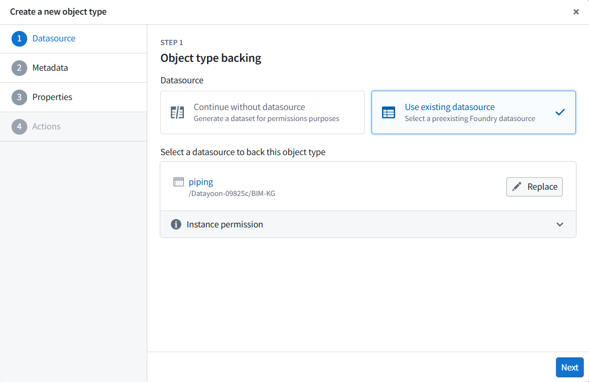
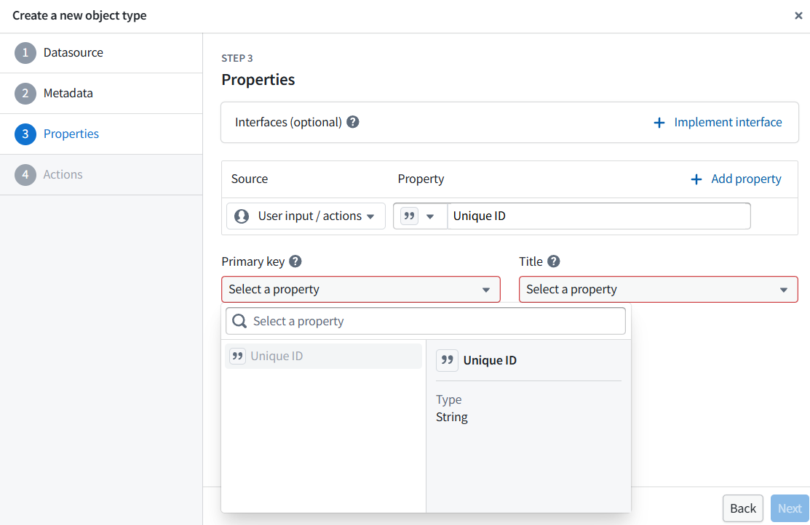
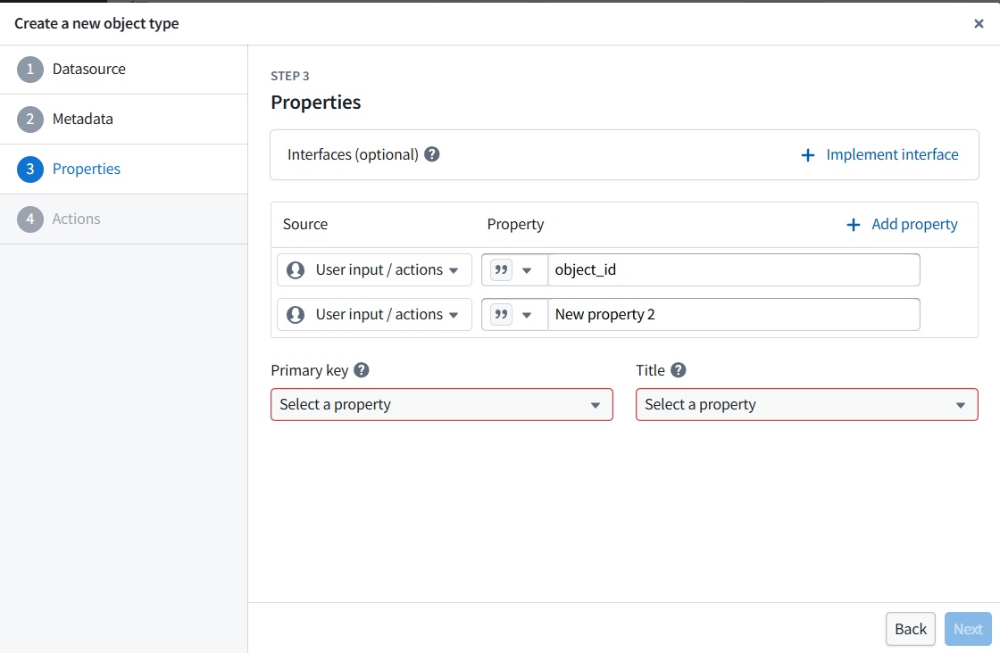

# Foundry Setup Guide — BIM-KG 프로젝트

> 이 문서는 Palantir Foundry Developer Tier 에서 BIM 데이터셋을 업로드하고
> Object Type 을 구성하는 과정에서 겪은 이슈와 해결 방법을 기록합니다.

---

## 1. 환경

- **Foundry URL**: `https://datayoon.usw-18.palantirfoundry.com`
- **프로젝트**: BIM-KG (`/Datayoon-09825c/BIM-KG`)
- **Ontology**: Datayoon Ontology
- **SDK**: palantir-sdk 0.12.0 + Python 3.12

## 2. 데이터셋 업로드

### 2.1 SDK 설정

```python
from palantir.core.config import StaticHostnameProvider, StaticTokenProvider
from palantir.datasets.client import PalantirContext, DatasetServices, DatasetsClient

hostname = StaticHostnameProvider('datayoon.usw-18.palantirfoundry.com')
token = StaticTokenProvider('your-token-here')
ctx = PalantirContext(hostname=hostname, auth=token)
services = DatasetServices(ctx)
client = DatasetsClient(services)
```

주의: hostname 에 `https://` 를 포함하면 안 됨.

### 2.2 데이터셋 생성

```python
ds_result = client.create_dataset("/Datayoon-09825c/BIM-KG/bim_piping", "master")
```

- branch 는 **`master`** 를 사용 (Developer Tier 기본)
- `main` branch 로 만들면 Foundry UI 에서 스키마가 안 보일 수 있음
- 이름 중복 시 `DuplicateDatasetName` 에러 — 기존 데이터셋을 영구 삭제 후 재생성

### 2.3 데이터 업로드

```python
from palantir.datasets.client import DatasetLocator
from palantir.datasets.core import Dataset

locator = DatasetLocator(rid, "master")
ds = Dataset(client, locator)
ds.write_pandas(df)
```

### 2.4 pandas 2.x 호환 이슈 (3가지)

| 문제 | 증상 | 해결 |
|------|------|------|
| `str` dtype | `Unsupported dtype: <class 'str'>` | `pd.set_option("future.infer_string", False)` — 모듈 최상단에 |
| All-null object 컬럼 | `IndexError: index 0 out of bounds` | `df[col] = ""` 로 채움 |
| Nullable `Int64` | `Unsupported dtype` | `df[col].astype("float64")` |

```python
import pandas as pd
pd.set_option("future.infer_string", False)  # CRITICAL: before any read

def fix_dtypes(df):
    for col in df.columns:
        if str(df[col].dtype) == "Int64":
            df[col] = df[col].astype("float64")
        elif df[col].dtype == object:
            if df[col].isna().all():
                df[col] = ""
            else:
                df[col] = df[col].fillna("")
    return df
```

상세: [`foundry-dtype-compatibility.md`](foundry-dtype-compatibility.md)

### 2.5 검증

```python
df2 = ds.read_pandas()
print(f"{len(df2)} rows × {len(df2.columns)} cols")
```

`read_pandas()` 로 읽히면 Foundry 에서도 스키마 인식 됨.

### 2.6 데이터셋 삭제 주의

- SDK 로 삭제: compass API 에서 trash → permanent delete
- **UI 에서 삭제 후에도 이름이 점유됨** — Trash 에서 영구 삭제해야 같은 이름 재사용 가능
- Trash 가 UI 에서 안 보이면 → 다른 이름으로 재생성이 더 빠름

## 3. Object Type 생성

### 3.1 Ontology Manager 접근

Foundry 좌측 → Ontology → Ontology Manager (또는 데이터셋 → Create Object Type)

### 3.2 생성 4단계

| Step | 설정 | 값 |
|------|------|---|
| 1. Datasource | Use existing datasource | `bim_piping` 등 선택 |
| 2. Metadata | Object type name | `PipingComponent` 등 |
| 3. Properties | + Add property → **Source 를 "Datasource column" 으로 변경** | `object_id`, `display_name` 등 |
| 3. Primary key | | `object_id` |
| 3. Title | | `display_name` |
| 4. Actions | Generate action types | 기본값 → Save |

### 3.3 주의: Step 3 에서 Source 설정

- 기본값이 **"User input / actions"** 로 되어있음 → 이 상태에서는 데이터셋 컬럼이 안 보임
- **반드시 Source 드롭다운을 클릭해서 "Datasource column" (또는 데이터셋 이름) 으로 변경**
- 변경 후 property 드롭다운에 219개 컬럼이 나타남

### 3.4 "Schema is not shown since the branch is empty" 에러

- 원인: 데이터셋에 `main` branch 로 업로드했지만 Foundry UI 가 `master` 를 기대
- 해결: `master` branch 로 재업로드
- 또는: 데이터셋 삭제 후 `master` branch 로 재생성

### 3.5 6개 Object Type

| Name | Dataset | PK | Title |
|------|---------|:--:|-------|
| PipingComponent | bim_piping | object_id | display_name |
| StructuralMember | bim_structural | object_id | display_name |
| Equipment | bim_equipment | object_id | display_name |
| ElectricalComponent | bim_electrical | object_id | display_name |
| HvacComponent | bim_hvac | object_id | display_name |
| UncategorizedObject | bim_other | object_id | display_name |

## 4. Link Type 생성 (TODO)

아직 미구성. Foundry 내부 Help 문서 참조 필요.

예정 Link Types:
- AdjacentTo: bim_adjacent_to (source_object_id → target_object_id)
- HasParent: bim_has_parent (child_object_id → parent_object_id)
- BelongsToPipeline: bim_belongs_to_pipeline (object_id → pipeline_name)
- InGroup: bim_in_group (object_id → group_id)

## 5. 스크린샷 부록

작업 중 마주친 화면들. 각 캡처는 `docs/reference/foundry-setup-figures/` 에 저장.

### 5.1 Step 1 — Datasource backing 선택 ✅



`Use existing datasource` 선택 → `/Datayoon-09825c/BIM-KG/piping` (또는 다른 dataset)
지정. 이 단계가 끝나야 Step 3 의 property 드롭다운에 컬럼이 나타남.

### 5.2 Step 3 — Source 가 "User input / actions" 인 잘못된 상태 ❌



Source 컬럼이 기본값 `User input / actions` 로 되어있어 dataset 의 컬럼이
보이지 않는 상태. Property 드롭다운에는 `Unique ID` (system-generated) 만 표시됨.
**해결**: Source 를 `Datasource column` (또는 dataset 이름) 으로 변경.

### 5.3 Step 3 — Properties 추가했지만 Primary key 미선택 ❌



Property 행을 두 개 추가했지만 Source 가 여전히 `User input / actions` 라
실제 dataset 컬럼이 매핑되지 않음. Primary key 와 Title 드롭다운이 빨간
border 로 미설정 표시. **해결**: 5.2 와 동일 — Source 를 `Datasource column`
으로 변경 → property 가 219개 컬럼으로 채워짐 → `object_id` PK, `display_name`
Title 선택 가능.

---

## 6. Dataset RIDs

```
bim_piping:               ri.foundry.main.dataset.2388ddc2-3c83-4ef3-a7df-fef11024bb4e
bim_structural:           ri.foundry.main.dataset.32658e86-ad1b-4adb-8acf-c3c409a21661
bim_equipment:            ri.foundry.main.dataset.5e250030-37c1-4475-aaac-8a9e9bf42e64
bim_electrical:           ri.foundry.main.dataset.29338c90-e5be-4db7-86f9-eb0449340873
bim_hvac:                 ri.foundry.main.dataset.914af224-32c8-48c5-b419-47eab341e33b
bim_other:                ri.foundry.main.dataset.87c921ea-cfcb-4ba5-b656-4bcacde11804
bim_adjacent_to:          ri.foundry.main.dataset.d6f789d4-54d7-49d1-9351-b20e825624dc
bim_has_parent:           ri.foundry.main.dataset.159d949e-fe9b-4267-a20e-57512e0600d8
bim_belongs_to_pipeline:  ri.foundry.main.dataset.97db7363-a24e-4cd8-870c-39450ba9bbfa
bim_in_group:             ri.foundry.main.dataset.0e57446a-bbc6-4443-bec8-7cbf58103e65
```

---

*Last updated: 2026-04-14*
